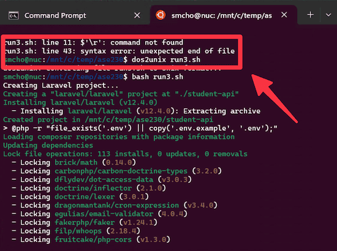

<!-- _class: frontpage -->
<!-- _paginate: skip -->

# Laravel Installation

Getting Started with Laravel (Linux/WSL2/Mac)

⚠️ WSL2 Warning: Run `dos2unix` command before running any scripts.

---

## Prerequisites

### What You Need:

- ✅ **PHP 8.2+** (you should already have this)
- ✅ **MySQL** (you should already have this)
- ✅ **Composer** (PHP package manager)
- ✅ **Web server** (built-in PHP server works)

---

### Run the script to Check/Install Automatically

You can manually check and set the applications (Module 1), but you can also run scripts to automate the process.

**For Linux/WSL2**

```bash
bash wsl2_install
```

**For Mac**

```bash
bash mac_install
```

---

### Set the MySQL root Password

For the rest of this module, we use the root password as '123456', so I recommend that you change the MySQL root password to facilitate the process.

```sql
if [[ "$OSTYPE" == "darwin"* ]]; then
  MYSQL="mysql"
else
  MYSQL="sudo mysql"
fi
$MYSQL -u root -p << EOF
ALTER USER 'root'@'localhost' IDENTIFIED BY '123456';
FLUSH PRIVILEGES;
EOF
```

Or, run the `mysql_root_password.sh` script to automate this process.

```bash
bash mysql_root_password.sh
```

---

### Create the MySQL Database for Laravel

```bash
# Create database and user
if [[ "$OSTYPE" == "darwin"* ]]; then
  MYSQL="mysql"
else
  MYSQL="sudo mysql"
fi

$MYSQL -u root -p << EOF
CREATE DATABASE IF NOT EXISTS $DB_NAME;
CREATE USER IF NOT EXISTS '$DB_USER'@'localhost' IDENTIFIED BY '$DB_PASSWORD';
GRANT ALL PRIVILEGES ON $DB_NAME.* TO '$DB_USER'@'localhost';
FLUSH PRIVILEGES;
EOF
```

Or, run the `mysql_user.sh` script to automate this process..

```bash
bash mysql_user.sh
```

---

### Create the MySQL Database for Laravel

```bash
# Create database and user
if [[ "$OSTYPE" == "darwin"* ]]; then
  MYSQL="mysql"
else
  MYSQL="sudo mysql"
fi

$MYSQL -u root -p << EOF
CREATE DATABASE IF NOT EXISTS $DB_NAME;
CREATE USER IF NOT EXISTS '$DB_USER'@'localhost' IDENTIFIED BY '$DB_PASSWORD';
GRANT ALL PRIVILEGES ON $DB_NAME.* TO '$DB_USER'@'localhost';
FLUSH PRIVILEGES;
EOF
```

Run the `mysql_user.sh` script.

```bash
bash mysql_user.sh
```

---

### ⚠️ WSL2 Setup (Only for WSL2 Users)

Copy the wslconfig file as C:\Users\<user>\.wslconfig, for example `c:\Users\smcho\.wslconfig`:

```text
[wsl2]
networkingMode=mirrored
```

Or, run the `make_wslconfig.sh` script to automate this process..

```bash
bash make_wslconfig.sh
```

⚠️ For WSL2 users, add `--host=0.0.0.0` option so your Windows OS can access the WSL2 server.

```php
php artisan serve --host=0.0.0.0 --port=8000
```

---

## How the Installer Script Works (Manual Install)

You can use the following content to install the required tools manually. Otherwise, skip to the next section, "Creating Your First Laravel Project".

**Check if PHP is installed**

```bash
$ which php
/usr/bin/php
$ php -v
PHP 8.4.12 (cli) (built: Aug 29 2025 06:47:47) (NTS)
Copyright (c) The PHP Group
```

---

**Install PHP**

```bash
sudo apt update && sudo apt upgrade -y
```

```bash
sudo apt install -y php php-cli php-fpm php-json \
php-common php-mysql php-zip php-gd php-mbstring \
php-curl php-xml php-pear php-bcmath php-sqlite3
```

---

### Install Composer

### Linux (WSL2):

```bash
curl -sS https://getcomposer.org/installer | php
sudo mv composer.phar /usr/local/bin/composer
```

### macOS:

```bash
brew install composer
```

---

### Check Your Setup:

```bash
php --version        # Should be 8.2+
composer --version   # Should be installed
mysql --version      # Should be installed
```

```bash
$ php --version
PHP 8.4.12 (cli) (built: Aug 29 2025 06:47:47) (NTS)
Copyright (c) The PHP Group
Built by Debian
Zend Engine v4.4.12, Copyright (c) Zend Technologies
    with Zend OPcache v8.4.12, Copyright (c), by Zend Technologies

$ composer --version
Composer version 2.8.11 2025-08-21 11:29:39
PHP version 8.4.12 (/usr/bin/php8.4)
Run the "diagnose" command to get more detailed diagnostics output.

$ mysql --version
mysql  Ver 8.0.43-0ubuntu0.22.04.1 for Linux on x86_64 ((Ubuntu))
```

You should be able to run MySQL on your computer.

```bash
sudo mysql -u root -p # Linux/WSL2
mysql -u root -p # Mac
```

---

### Check if MySQL is running:

```bash
# Linux/WSL2
$ sudo netstat -tlnp | grep 3306

tcp        0      0 127.0.0.1:33060         0.0.0.0:*               LISTEN      18508/mysqld
tcp        0      0 127.0.0.1:3306          0.0.0.0:*               LISTEN      18508/mysqld

# Mac
$ lsof -nP -iTCP:3306 -sTCP:LISTEN
COMMAND  PID  USER   FD   TYPE             DEVICE SIZE/OFF NODE NAME
mysqld  2864 chos5   31u  IPv4 0x129757e677649a20      0t0  TCP 127.0.0.1:3306 (LISTEN)
```

---

**If MySQL is not running, start the MySQL server**

```bash
# Linux/WSL2
$ sudo systemctl start mysql
# Command to stop
# sudo systemctl stop mysql 

# Mac
brew services start mysql
# This will start the MySQL server as a background service, 
# making it automatically restart at login
# Alternatively, if you want to start MySQL just for the current session 
# (without running as a service), you can use:
mysql.server start
# This starts MySQL for the current terminal session and will not restart automatically after reboot
```

---

### In case you need to install MySQL on Linux/WSL2

```bash
sudo apt update && sudo apt upgrade -y
```

**MySQL**

```bash
sudo apt install mysql-client-core-8.0 -y
sudo apt install mysql-server -y
```

---

## Creating Your First Laravel Project

### Using Composer

```bash
composer create-project laravel/laravel student-api
cd student-api
```

**This creates a complete Laravel application!**

---

## Starting the Development Server

```bash
cd student-api
php artisan serve

For WSL2

php artisan serve --host:0.0.0.0
```

---

### Default URLs:

- **Web**: <http://localhost:8000>

### You should see:

**"Laravel" welcome page** - Your installation is successful!

---

## Laravel Project Structure

```txt
student-api/
├── app/                    # Your application code
│   ├── Http/Controllers/   # Controllers (MVC) **
│   ├── Models/            # Models
│   └── ...
├── routes/                # URL routing
│   ├── web.php           # Web routes
│   └── api.php           # API routes
├── database/             # Database files
│   ├── migrations/       # Database structure
│   └── seeders/         # Sample data
├── resources
│   ├── css
│   ├── js
│   └── views/           # Views
└── config/              # Configuration files
```

---

## Key Directories Explained

### `/app` - Your Code Lives Here

```txt
app/
├── Http/Controllers/    # Handle requests (Controller in MVC)
├── Models/             # Data models (Model in MVC)
├── Providers/          # Service providers
└── Exceptions/         # Error handling
```

Notice the **Controller & Model** in this directory.

### `/routes` - Define URLs

```txt
routes/
├── web.php            # Website routes
├── api.php            # API routes (we'll use this!)
└── console.php        # Command line routes
```

---

### `/resources/views/` - Views

```txt
resources/
├── css
├── js
└── views/           # Views (MVC) **
```

Notice the **View** (MVC) in this directory.

---

## Database Directory

```txt
database/
├── migrations/         # Database schema
│   └── create_users_table.php
├── seeders/           # Sample data
│   └── DatabaseSeeder.php
└── factories/         # Test data generators
    └── UserFactory.php
```

The `migrations` in Laravel mean database schema.

**Laravel manages your database structure with code!**

---

## Configuration Files

```txt
config/
├── app.php            # App settings
├── database.php       # DB connections
├── cors.php           # API CORS settings
└── ...
```

---

### Environment File (.env)

The .env file

- Holds environment-specific configuration.
- Keeps sensitive or changing values outside of code.

**Never commit .env to version control!**

The .gitignore has .env to avoid submission to Git/GitHub.

---

### App Name & URL

```env
APP_NAME=StudentAPI
APP_URL=http://localhost:8000
```

You need to change the APP_URL accordingly when you deploy your Laravel app.

---

#### App Key

```env
APP_KEY=YOUR_APP_KEY
```

- It’s a secret cryptographic key used by Laravel, generated by this command.
- Laravel 12.x or later automatically generates APP_KEY, but if you use an old version, you need to run this command.

```php
php artisan key:generate --force
```

- Required for:

  - Encrypting / Decrypting data (Crypt::encrypt(), Crypt::decrypt()).
  - Signing session and cookie data so they can’t be tampered with.

- Without a valid APP_KEY, encrypted data becomes unreadable.

---

#### Database

This section describes the database used by Laravel.

By default, Laravel uses `SQLite`.

```env
DB_CONNECTION=sqlite
# DB_HOST=127.0.0.1
# DB_PORT=3306
# DB_DATABASE=laravel
# DB_USERNAME=root
# DB_PASSWORD=
```

---

We use MySQL, not SQLite, so we need to change the database configuration.

```env
DB_CONNECTION=mysql
DB_HOST=127.0.0.1
DB_PORT=3306
DB_DATABASE=laravel_app
DB_USERNAME=laravel_user
DB_PASSWORD=password123
```

---

### Composer file (composer.json)

The **`composer.json`** file is the heart of dependency management in Laravel; It tells Composer (PHP’s package manager) what libraries and configurations your project needs.

#### Purpose

- Defines **dependencies** (Laravel framework, third-party packages).  
- Configures **autoloading** for classes.  
- Declares **project metadata** (name, description, license).  
- Controls **scripts** for automation (e.g., clearing cache, running tests).  

---

#### Key Sections

1. **require**

- Lists mandatory PHP packages  
- Example:

```json
"require": {
    "php": "^8.2",
    "laravel/framework": "^12.0",
    "laravel/tinker": "^2.10.1"
},
```

---

2. **require-dev**

- Packages only for development/testing
- Example:

```json
"require-dev": {
    "fakerphp/faker": "^1.23",
    "laravel/pail": "^1.2.2",
    "laravel/pint": "^1.24",
    "laravel/sail": "^1.41",
    "mockery/mockery": "^1.6",
    "nunomaduro/collision": "^8.6",
    "phpunit/phpunit": "^11.5.3"
}
```

---

3. **autoload/autoload-dev**

- Defines how PHP classes are loaded
- Example:

```json
"autoload": {
    "psr-4": {
        "App\\": "app/",
        "Database\\Factories\\": "database/factories/",
        "Database\\Seeders\\": "database/seeders/"
    }
},
"autoload-dev": {
    "psr-4": {
        "Tests\\": "tests/"
    }
},
```

This tells Composer that the namespace App\ maps to the app/ directory.

---

4. **scripts**

- Automates tasks via Composer commands
- Example:

```json
"scripts": {
    "post-autoload-dump": [
        "Illuminate\\Foundation\\ComposerScripts::postAutoloadDump",
        "@php artisan package:discover --ansi"
    ],    
    "test": [
        "@php artisan config:clear --ansi",
        "@php artisan test"
    ]
}
```

---

5. **extra**

- Holds extra configuration for Laravel or packages
- Example:

```json
"extra": {
  "laravel": {
    "dont-discover": []
  }
}
```

---

#### Composer Workflow

1. Edit composer.json (add/remove packages).
2. Run:

```bash
composer install     # Install dependencies
composer update      # Update dependencies
```

3. Composer generates composer.lock to lock exact versions.

---

## Run Laravel Server with Different Port

In the Laravel project, we can start the server.

```bash
php artisan serve
php artisan serve --port=8080

#WLS2

php artisan serve --host=0.0.0.0 --port=8080

```

---

### Change port number in the .env

You can change the .env file to change the port number.

```env
APP_URL=http://localhost:8080 # Change your port
```

Then clear the cache:

```bash
php artisan config:cache
```

However, it only affects how URLs are generated by Laravel internally (like URL helpers and redirects), but it does not change the port the built-in PHP server listens on when you run the server.

---

## Copy and run the corresponding script in the code directory

### ⚠️ WSL2: dos2unix

- You may have an error "'\r' command not found" if you run scripts on WSL2.
- ⚠️ Run `dos2unix` command to remove this error.

```dos
# install the package if necessary
# sudo apt install dos2unix 
dos2unix run2-2.sh
```



---

### Run the script

Copy the run2-2.sh from the corresponding code directory in your exercise directory (for example, ~/temp/ase456).

```bash
# in the temp/ase230 directory (for example)
bash run2-2.sh # run script
cd student-api 
php artisan serve
# WSL2
php artisan serve --host=0.0.0.0
# Access <http://localhost:8080>
```

---

## Artisan - Laravel's Command Tool

In the Laravel project, an `artisan` PHP script is used to access and manipulate the Laravel project.

```bash
php artisan about # Show Laravel's self-awareness
php artisan route:list        # See all routes
```

---

### Tinker Interactive exploration Tool

We can use Tinker to check the Laravel project interactively.

```bash
php artisan tinker
```

Inside the tinker:

```php
File::exists(base_path('composer.json')) # Check if file exists
File::get(base_path('README.md'))       # Read any file
```
