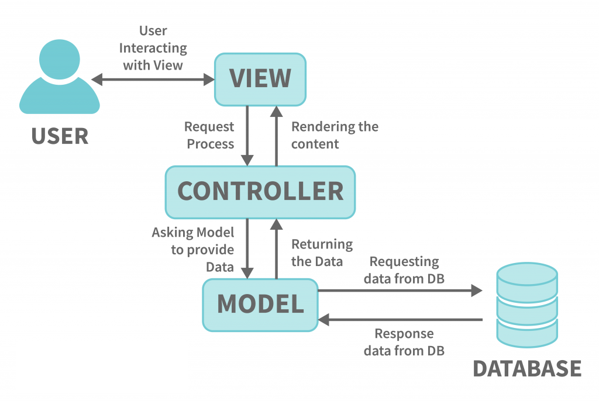
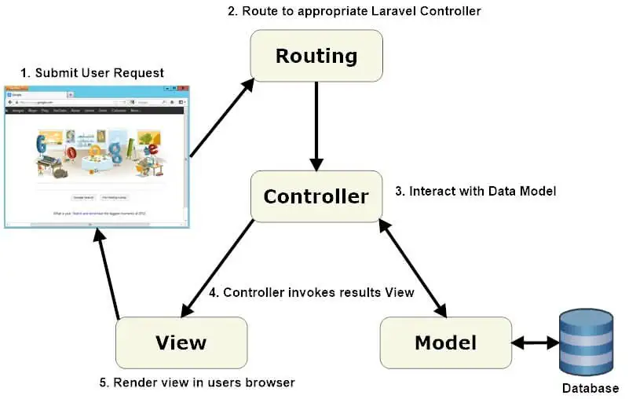

<!-- _class: lead -->
<!-- _class: frontpage -->
<!-- _paginate: skip -->

<!-- _class: frontpage -->
<!-- _paginate: skip -->

# MVC Architecture

Model-View-Controller Pattern

---

## The Problem: Spaghetti Code

### Current PHP Structure

```php
// Everything mixed in handlers.php
function create_student() {
    // 1. Get input data (Controller logic)
    $input = getRequestData();
    // 2. Business logic (Model logic)
    $students = load_students();
    $new_id = get_next_id($students);
    // 3. Save data (Model logic)
    save_students($students);
    // 4. Return response (View logic)
    echo json_encode(['success' => true, ...]);
}
```

**All responsibilities (input, processing, display) mixed!**

---

## What is MVC?

**MVC** = **M**odel + **V**iew + **C**ontroller

> A design pattern that **separates concerns** into three distinct layers.

### Restaurant Analogy

- **Model** = Kitchen (data preparation)
- **View** = Presentation (how food looks on a plate)
- **Controller** = Waiter (takes orders, coordinates)

---

## MVC Components

### **Model** - Data Layer

- Handles data and business logic
- Database interactions
- Data validation
- Business rules

---

### **View** - Presentation Layer  

- User interface
- HTML templates
- JSON responses
- What the user sees

### **Controller** - Logic Layer

- Receives user requests
- Coordinates Model and View
- Makes decisions
- Controls flow

---



---

## Benefits of MVC

### 1. **Separation of Concerns**

- Each part has one responsibility
- Easier to understand and maintain
- Changes in one layer don't affect others

---

### 2. **Reusability**

- Different controllers can use models
- Views can display different data
- Controllers can use different models

### 3. **Testability**

- Test each layer independently
- Mock dependencies easily
- Better code quality

---

## Manual Code vs MVC

### Manual PHP (handlers.php)

```php
function get_all_students() {
    // Model logic mixed with Controller logic
    $students = load_students();           // Model
    
    // View logic mixed in
    echo json_encode([                     // View
        'success' => true,
        'data' => $students,
        'count' => count($students)
    ]);
}
```

---

**Problems:**

- Hard to test individual parts
- Difficult to reuse logic
- Changes affect multiple concerns

---

## MVC in Laravel

```txt
app/
├── Models/
│   └── Student.php             # Model
└── Http/Controllers/           
    └── StudentController.php   # Controller
resources
└── views/
     └── student.blade.php      # VIEW
```

**Laravel enforces MVC automatically!**

---

### Why the View is not in the `app` directory?

- In Laravel, **Views are not inside `app/`**.  
- Instead, they are stored in:  

  ```txt
  resources/
  └── views/
      └── student.blade.php   # HTML templates

Laravel uses the `blade` template engine, and `reserouces/views/` has all the templates.

---

## MVC Flow (Laravel)

To implement the REST API using Laravel, we need MVC + Routing.

1. Web Browser (curl): Submit User Request
2. **Routing**: Route to appropriate Laravel Controlle
3. **Controller**: Interact with Data Model

- **Model** → Database

4. **Controller**: Invokes Results View
5. **View**: Render view in the user's browser (curl)

---



---

## REST API Implementation with MVC + Routes

```txt
GET /students → StudentController → Student Model → Database
                                                            ↓
User ← JSON Response ← View ← StudentController ← Model Data
```

1. Web Browser: Makes a GET /students request
2. **Routing**: parses `/students`
3. **Controller**: StudentController

- **Model** → Student Model/Database/Model Data

4. **Controller**: StudentController
5. **View**: JSON Response

---

### Model

The Model has functions related to the data (in this example, students); it can access the Database.

```php
class Student extends Model {
    public static function getAll() {
        return self::all();  // Get all students
    }
    
    public static function findById($id) {
        return self::find($id);  // Find specific student
    }
}
```

---

### View

The View displays data to the user (UI); Laravel typically uses **Blade**, Laravel’s templating engine (Blade files end with `.blade.php`).

```blade
<!-- resources/views/students.blade.php -->
<!DOCTYPE html>
<html>
  <head><title>Students</title></head>
  <body>
    <h1>Student List</h1>
    <ul>
      @foreach($students as $student)
        <li>{{ $student->name }}</li>
      @endforeach
    </ul>
  </body>
</html>
```

---

### Controller

The Controller has functions that process and make responses; it communicates with the Model.

```php
class StudentController {
    public function index() {
        $students = Student::getAll();       // Use Model
        return response()->json($students);  // Return View
    }
    public function store(Request $request) {
        $student = Student::create($request->all());  // Model
        return response()->json($student);            // View
    }
}
```

---

### Routes

The Route maps endpoints (students in this example) to the method (store) in the Controller class (StudentController).

```php
Route::post('/students', [StudentController::class, 'store']);
```

**Clean, organized, professional!**

---

## MVC Beyond Laravel

### Other Frameworks Using MVC:

- **JavaScript**: Angular, Vue.js
- **Python**: Django, Flask
- **Ruby**: Ruby on Rails
- **Java**: Spring MVC
- **C#**: ASP.NET MVC

**Learn MVC once, apply everywhere!**

---

## Common MVC Questions

### Q: "Is MVC the only choice to use?"

**A:** No! But it's the most popular for web applications.

### Q: "What about small projects?"

**A:** MVC helps even small projects grow cleanly.

### Q: "Does it make code more complex?"

**A:** Initially, yes, but it saves time long-term.

---

## Key Takeaway

- ✅ **MVC separates concerns** - Model, View, Controller
- ✅ **Better organization** - Each part has one job
- ✅ **Industry standard** - Used by all major frameworks
- ✅ **Laravel enforces MVC** - Automatic structure
