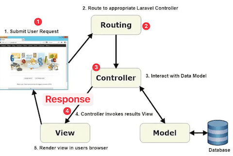

<!-- _class: frontpage -->
<!-- _paginate: skip -->

# Laravel Routes and Controllers

Simple Route → Controller Connection

---

## What We're Learning

### **Core Concept:**

**URL** → **Route** → **Controller Method** → **Response**

```txt
1. User visits: /students
    ↓
2. Route: Route::get('/students', [StudentController::class, 'index'])
    ↓
3. Controller: StudentController@index()
    ↓
4. Response: HTML or JSON
```

**Focus: How routes connect URLs to code**

---



---

## Two Types of Routes

### **Web Routes** (`routes/web.php`)

- For **web browsers**
- Returns **simple HTML strings**
- URLs: `/students`

### **API Routes** (`routes/api.php`)  

- For **applications**
- Returns **JSON data**
- URLs: `/api/students`

**Same controller logic, different response format**

---

### Edit `bootstrap/app.php` to use API Routes

```php
return Application::configure(basePath: dirname(__DIR__))
    ->withRouting(
        web: __DIR__.'/../routes/web.php',
        api: __DIR__.'/../routes/api.php',  // ← ADD THIS LINE!
        commands: __DIR__.'/../routes/console.php',
        health: '/up',
    )
    // ... rest of file
```

---

## Simple Student Data

We'll use **one student** for simplicity:

```php
$student = [
    'id' => 1, 
    'name' => 'John Doe', 
    'major' => 'Computer Science'
];
```

**Goal: Understand routing, not data management**

---

## Web Route Example

### `routes/web.php`:

The controllers are in `App\Http\Controllers\StudentController.php`.

```php
<?php
use App\Http\Controllers\StudentController;

// Simple web routes
Route::get('/student', [StudentController::class, 'show']);
Route::post('/student', [StudentController::class, 'store']);
```

### URLs:

- `GET /student` → Show student info (HTML)
- `POST /student` → Create student (HTML)

---

## API Route Example

### `routes/api.php`:

The controllers are in `App\Http\Controllers\Api\StudentController.php`.

```php
<?php
use App\Http\Controllers\Api\StudentController;

// Simple API routes  
Route::get('/student', [StudentController::class, 'show']);
Route::post('/student', [StudentController::class, 'store']);
```

### URLs:

- `GET /api/student` → Show student info (JSON)
- `POST /api/student` → Create student (JSON)

---

## Laravel Controllers

### Without Controller (Bad):

```php
// Putting logic directly in routes
Route::get('/student', function() {
    $student = ['name' => 'John'];
    return '<h1>' . $student['name'] . '</h1>';
});
```

---

### With Controller (Good):

```php
// Clean routes
Route::get('/student', [StudentController::class, 'show']);

// Logic in controller
class StudentController {
    public function show() {
        $student = ['name' => 'John'];
        return '<h1>' . $student['name'] . '</h1>';
    }
}
```

**Controllers organize your code better!**

---

## Web Controller - Returns HTML

### `app/Http/Controllers/StudentController.php`:

GET /student maps to the show method in the StudentController class.

```php
Route::get('/student', [StudentController::class, 'show']);
```

```php
<?php
namespace App\Http\Controllers;

class StudentController extends Controller
{
    public function show()
    {
        $student = ['id' => 1, 'name' => 'John Doe', 'major' => 'Computer Science'];
        
        return '<h1>Student Info</h1>
                <p>ID: ' . $student['id'] . '</p>
                <p>Name: ' . $student['name'] . '</p>
                <p>Major: ' . $student['major'] . '</p>';
    }
```

---

POST /student maps to the store method in the StudentController class.

```php
Route::post('/student', [StudentController::class, 'store']);
```

```php
    public function store()
    {
        return '<h1>Success!</h1><p>Student created</p>';
    }
}
```

**Returns: Simple HTML strings**

---

## API Controller - Returns JSON

### `app/Http/Controllers/Api/StudentController.php`:

```php
<?php
namespace App\Http\Controllers\Api;
use App\Http\Controllers\Controller;

class StudentController extends Controller
{
    public function show()
    {
        $student = ['id' => 1, 'name' => 'John Doe', 'major' => 'Computer Science'];
        
        return response()->json($student);
    }
    
    public function store()
    {
        return response()->json(['message' => 'Student created']);
    }
}
```

**Returns: JSON data**

---

## Response Comparison

### Web Route Response:

**Browser sees:**

```html
<h1>Student Info</h1>
<p>ID: 1</p>
<p>Name: John Doe</p>
<p>Major: Computer Science</p>
```

---

### API Route Response:  

**Application receives:**

```json
{
    "id": 1,
    "name": "John Doe", 
    "major": "Computer Science"
}
```

**Same data, different format!**

---

## Key Differences Summary

| Aspect       | Web Routes             | API Routes              |
|--------------|------------------------|-------------------------|
| **Purpose**  | Human browsers         | Applications            |
| **URL**      | `/student`             | `/api/student`          |
| **Response** | HTML strings           | JSON data               |
| **Forms**    | HTML forms needed      | JSON data sent directly |
| **Methods**  | GET, POST (with forms) | GET, POST (with JSON)   |

---

## Route Parameters

### Route with Parameter:

```php
// routes/web.php
Route::get('/student/{id}', [StudentController::class, 'show']);
```

### Controller Method:

```php
public function show($id)
{
    return '<h1>Student ID: ' . $id . '</h1>';
}
```

---

### Test:

- Visit: `/student/123`
- Output: `<h1>Student ID: 123</h1>`

**Laravel automatically passes {id} to your method!**

---

## Request Data Handling

### Form Data Example:

```php
public function store(Request $request)
{
    $name = $request->name;    // Get form field
    $major = $request->major;  // Get form field
    
    return '<h1>Created: ' . $name . '</h1>
            <p>Major: ' . $major . '</p>';
}
```

---

### Test with HTML Form:

```html
<form method="POST" action="/student">
    Name: <input name="name">
    Major: <input name="major">
    <button type="submit">Create</button>
</form>
```

---

## Creating Controllers

### Generate Web Controller:

```bash
php artisan make:controller StudentController
```

Creates: `app/Http/Controllers/StudentController.php`

```php
<?php

namespace App\Http\Controllers;

use Illuminate\Http\Request;

class StudentController extends Controller
{}
```

---

**With --api argument, artisan generates all five controller methods.**

```bash
php artisan make:controller StudentController --api
```

Creates: `app/Http/Controllers/StudentController.php`

```php
<?php
namespace App\Http\Controllers;
use Illuminate\Http\Request;

class StudentController extends Controller
{
    public function index() {}
    public function store(Request $request) {}
    public function show(string $id) {}
    public function update(Request $request, string $id) {}
    public function destroy(string $id) {}
}

```

---

### Generate API Controller:

```bash
php artisan make:controller Api/StudentController
```

Creates: `app/Http/Controllers/Api/StudentController.php`

```php
<?php

namespace App\Http\Controllers\Api;

use App\Http\Controllers\Controller;
use Illuminate\Http\Request;

class StudentController extends Controller
{}
```

---

## Testing Your Routes

### View All Routes:

```bash
php artisan route:list
```

### Output:

```txt
Method  URI           Controller
GET     student       StudentController@show
POST    student       StudentController@store
GET     api/student   Api\StudentController@show
POST    api/student   Api\StudentController@store
```

---

## Testing in Browser

### Test Web Routes:

1. Start server: `php artisan serve`
2. Visit: `http://localhost:8000/student`
3. See: HTML page with student info

### Test API Routes:

1. Visit: `http://localhost:8000/api/student`  
2. See: JSON data in browser

**Same controller logic, different URLs and responses!**

---

## run1-4.sh

⚠️ WSL2 Warning: Run `dos2unix` command before running the script.

Copy the corresponding files and script from the corresponding directory.

```bash
# in the temp/ase230 directory (for example)
bash run1-4.sh # run script
cd student-api 
php artisan serve
# WSL2
php artisan serve --host=0.0.0.0
# Access <http://localhost:8080>
```

---

Access the Laravel server application using curl or web browsers.

```bash
# web API
http://localhost:8000/student

# api API
http://localhost:8000/api/student
```
