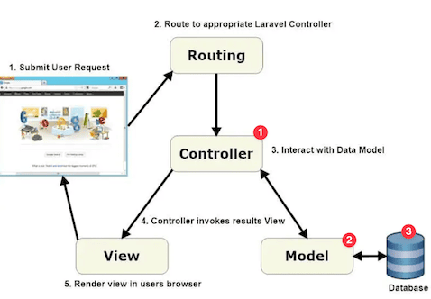
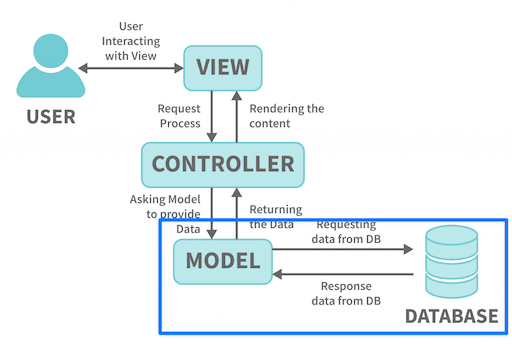

<!-- _class: frontpage -->
<!-- _paginate: skip -->

# Laravel Models and Controllers

From Mockup Data to Real Database Operations

---

## Recap: Routes and Controllers

In the previous lesson, we learned about **Routes and Controllers** using **mockup data**:

```php
    private function getStudent()
    {
        return [
            'id' => 1,
            'name' => 'John Doe',
            'major' => 'Computer Science'
        ];
    }
```

**Today**: Replace mockup data with **real database operations** using **Laravel Models**

---

## The MVC Pattern in Laravel (Revisited)

### **Model-View-Controller (MVC)**

```txt
Request → Routes → (1) Controller → (2) Model → (3) Database
                      ↓
Response ← View ←─────┘
```

- **Model**: Handles data and database operations
- **View**: Handles presentation (HTML/JSON responses)  
- **Controller**: Handles business logic and coordinates Model + View

---



---

## What is a Laravel Model?

### **Model = Database Table Representation**

```php
// Student Model represents 'students' table
class Student extends Model
{
    // Model automatically handles:
    // ✅ Database connections
    // ✅ CRUD operations (Create, Read, Update, Delete)  
    // ✅ Data validation
    // ✅ Relationships with other models
    // ✅ Query building
}
```

**One Model = One Database Table**

---

## Creating the Student Model

### Generate Model with Migration:

```bash
php artisan make:model Student -m
```

This is a combination of two commands:

```bash
php artisan make:model Student
php artisan make:migration create_students_table
```

### This Creates Two Files:

1. **`app/Models/Student.php`** - The model class
2. **`database/migrations/xxxx_create_students_table.php`** - Database structure

---

### What this creates:

- **Model**: PHP class to interact with the database
- **Migration**: Blueprint to create a database table



---

## Student Model Definition

Laravel creates the Model class that inherits from the Model class; we can use these methods freely.

| Operation      | Laravel Model             |
|----------------|---------------------------|
| **Get All**    | `return Student::all();`  |
| **Find by ID** | `Student::find($id)`      |
| **Create**     | `Student::create($data)`  |
| **Update**     | `$student->update($data)` |
| **Delete**     | `$student->delete()`      |
| **Validation** | Built-in validation       |

---

### `app/Models/Student.php`:

We need to specify the elements in the Model by adding code.

```php
<?php
namespace App\Models;
use Illuminate\Database\Eloquent\Model;

class Student extends Model
{
    /**
     * Fields that can be mass assigned
     */
    protected $fillable = [
        'name',
        'email', 
        'major',
        'year'
    ];

    /**
     * Cast attributes to specific types
     */
    protected $casts = [
        'year' => 'integer',
    ];
}
```

---

### Model Features Explained

**$fillable** - Mass Assignment Protection

We use the create static method to create a student model, but we can use only the fillable elements.

```php
// ✅ Safe - only allowed fields can be set
$student = Student::create([
    'name' => 'John Doe',
    'email' => 'john@university.edu',
    'major' => 'Computer Science',
    'year' => 2
]);

// ❌ Dangerous without $fillable protection
$student = Student::create($request->all()); // Could set any field!
```

**$fillable** prevents malicious users from setting unexpected fields

---

## Generated Migration

### database/migrations/xxxx_create_students_table.php

File: `database/migrations/2024_xx_xx_create_students_table.php`

```php
<?php
use Illuminate\Database\Migrations\Migration;
use Illuminate\Database\Schema\Blueprint;
use Illuminate\Support\Facades\Schema;

// anonymous class (Laravel 8 and PHP 7+)
return new class extends Migration
{
    public function up() { ... }
    public function down() {...}
}    
```

---

As the automatically generated class is empty, we need to make the schema for the class accordingly.

```php
public function up()
{
    Schema::create('students', function (Blueprint $table) {
        $table->id();                    // Auto-increment primary key
        $table->string('name');          // VARCHAR(255)
        $table->string('email')->unique(); // UNIQUE VARCHAR(255)
        $table->string('major');         // VARCHAR(255)
        $table->integer('year');         // INT
        $table->timestamps();            // created_at, updated_at
    });
}
```

---

This allows the migration to be rolled back safely.

```php
public function down()
{
    Schema::dropIfExists('students');
}
```

---

### Run Migration to Create Table

```bash
# Create the database table
php artisan migrate

# Output:
# Migrating: 2024_01_01_000000_create_students_table
# Migrated:  2024_01_01_000000_create_students_table (0.02 seconds)
```

---

**This creates the `students` DB table:**

| Field      | Type            | Extra                       |
|------------|-----------------|-----------------------------|
| id         | BIGINT UNSIGNED | PRIMARY KEY, AUTO_INCREMENT |
| name       | VARCHAR(255)    |                             |
| email      | VARCHAR(255)    | UNIQUE                      |
| major      | VARCHAR(255)    |                             |
| year       | INT             |                             |
| created_at | TIMESTAMP       |                             |
| updated_at | TIMESTAMP       |                             |

---

### Summary

1. `php artisan make:model Student -m` to create a model and migration.
2. Manually add the Student model and schema up() method.
3. `php artisan migrate` to create a DB table.

---

## Updating Controllers to Use Models

### **Before**: Web Controller with Mockup Data

```php
    public function index()
    {
        // Mockup data
        $student = $this->getStudent();
        
        return '<h1>Student Information</h1>
                <p>ID: ' . $student['id'] . '</p>
                <p>Name: ' . $student['name'] . '</p>
                <p>Major: ' . $student['major'] . '</p>
                <a href="/student/create">Add New Student</a>';
    }
```

---

### **After**: Web Controller with Model

```php
<?php
namespace App\Http\Controllers;
use App\Models\Student;
use Illuminate\Http\Request;

class StudentController extends Controller
{
    public function index()
    {
        // New way: Database query through Model
        $students = Student::all();
        return ...
    }

    public function show(Student $student)
    {
        // New way: Route Model Binding (automatic!)
        // Laravel automatically finds the student or returns 404
        return view('students.show', compact('student'));
    }
}
```

---

## Route Updates for Models

### Route Naming (->Name())

```php
Route::get('/students', [StudentController::class, 'index'])
    ->name('students.index');
Route::get('/students/{student}', [StudentController::class, 'show'])
    ->name('students.show');     
```

The ->name() is like giving a nickname to your route; you don't have to use hardcoding URLs.

```php
// Instead of hardcoding URLs (bad practice):
return redirect('/students');
return redirect("/students/{$student->id}");

// In your controllers
return redirect()->route('students.index');
return redirect()->route('students.show', $student);
```

---

### Model Binding

Model binding works when you have a parameter in your route:

```php
Route::get('/students/{student}', [StudentController::class, 'show'])
    ->name('students.show');
```

Without and with Model Binding:

```php
// Instead of writing this in your controller:
public function show($id) {
    // You have to do the database lookup
    $student = Student::findOrFail($id);
    return ...
}

// You can write this (much cleaner!):
public function show(Student $student) {
    return ...
}
```

---

In this example, when `/students/90` is given, the
Laravel automatically does this behind the scenes:

```php
// 1. Laravel extracts "90" from the URL parameter {student}
$id = 90;

// 2. Laravel automatically runs this query for you:
$student = Student::findOrFail(90);

// 3. Laravel passes the found Student object to your method:
public function show(Student $student) {...}
```

---

### The `resource` method for automatic Model Binding

When we need to make these

```php
// routes/web.php
Route::get('/students', ...
Route::get('/students/create', ...
Route::post('/students', ...
Route::get('/students/{student}', ...
Route::get('/students/{student}/edit', ...
Route::put('/students/{student}', ...
Route::delete('/students/{student}', ...
```

We can use the `resource` method:

```php
Route::resource('students', StudentController::class);
```

---

### **Updated API Routes**

For API, we can use apiResource (backslashes (\\) are used for namespaces):

```php
// routes/api.php
Route::apiResource('students', Api\StudentController::class);
```

---

## run1-5.sh

⚠️ WSL2 Warning: Run `dos2unix` command before running the script.

Copy the corresponding files and script from the corresponding directory.

```bash
# in the temp/ase230 directory (for example)
bash run1-4.sh # run script
cd student-api 
php artisan serve
# WSL2
php artisan serve --host=0.0.0.0
# Access <http://localhost:8080>
```

---

## Testing Your Models

### **Browser Testing (Web Routes)**

- Visit: `http://localhost:8000/students`
- Create, edit, and delete students through forms
- Data persists in the database

### **API Testing (Postman/curl)**

```bash
# Get all students
curl http://localhost:8000/api/students

# Create student
curl -X POST http://yourapp.com/api/students \
  -H "Content-Type: application/json" \
  -d '{"name":"Test Student","email":"test@uni.edu","major":"Engineering","year":1}'
```

**Data now persists between requests!**
