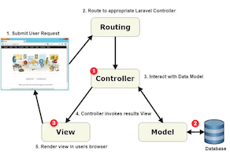

<!-- _class: frontpage -->
<!-- _paginate: skip -->

# (Optional) Laravel Views and Controllers

Building Complete Web Interfaces with Blade Templates

---

Even though Blade is an important part of Laravel, we don't use Laravel's Blade templates for the REST API server.

## Learning Journey So Far

### **Lesson 1**: Routes and Controllers

- URL routing to controller methods
- HTTP verbs (GET, POST, PUT, DELETE)
- Mockup data in controllers

### **Lesson 2**: Models and Controllers  

- Database operations with Eloquent
- Real data persistence
- Advanced queries and relationships

---

### **Today**: Views and Controllers

- **Blade templating engine**
- **HTML presentation layer**
- **Complete MVC pattern**

---

## MVC Pattern: The Complete Picture

```txt
Request → Routes → (1) Controller → (2) Model → Database
                        ↓              ↑
                   (3) View ←──────────┘
                        ↓
                  HTML Response
```



---

### **Complete Flow:**

1. **Route** receives request
2. **Controller** processes business logic
3. **Model** handles data operations
4. **View** renders HTML presentation
5. **Response** sent to browser

---

## What are Views?

### **Views = Presentation Layer**

```php
// Controller handles logic
public function index()
{
    $students = Student::all();           // Get data from Model
    return view('students.index', compact('students')); // Pass to View
}
```

```html
<!-- View handles presentation -->
<h1>Student List</h1>
@foreach($students as $student)
    <div>{{ $student->name }} - {{ $student->major }}</div>
@endforeach
```

**Views separate logic from presentation!**

---

## Laravel Blade Templating Engine

### **Blade = Laravel's Templating System**

- **File Extension**: `.blade.php`
- **Location**: `resources/views/`
- **Features**: Template inheritance, components, directives
- **Security**: Automatic HTML escaping

---

### **Blade vs Plain PHP**

**Plain PHP**:

```php
<h1><?php echo htmlspecialchars($title); ?></h1>
```

**Blade**:

```blade
<h1>{{ $title }}</h1>  <!-- Auto-escaped -->
```

---

## View Directory Structure

```txt
resources/views/
├── layouts/
│   └── app.blade.php           # Master layout
├── students/
│   ├── index.blade.php         # Student list
│   ├── show.blade.php          # Student details
│   ├── create.blade.php        # Create form
│   └── edit.blade.php          # Edit form
├── partials/
│   ├── header.blade.php        # Reusable header
│   └── footer.blade.php        # Reusable footer
└── welcome.blade.php           # Homepage
```

**Organized by feature/resource**

---

## Blade Template Inheritance

### **Layout Inheritance Directives**

- `@yield('section')`: Define placeholder in layout
- `@extends('layout')`: Extend a layout  
- `@section('name')`: Define section content
- `@endsection`: End section definition

### **Master Layout** (parent):

```blade
<title>@yield('title')</title>
<body>
    @yield('content')
</body>
```

### **Child View** (extends):

```blade
@extends('layouts.app')
@section('title', 'Student List')
@section('content')
    <h1>Students</h1>
@endsection
```

---

## Blade Directives Explained

### **Output Directives**

```blade
{{ $student->name }}           <!-- Escaped output (safe) -->
{!! $htmlContent !!}          <!-- Raw output (dangerous) -->
{{ $name ?? 'Unknown' }}      <!-- Default value if null -->
```

---

### **Control Flow Directives**

```blade
@if($students->count() > 0)
    <p>Found {{ $students->count() }} students</p>
@else
    <p>No students found</p>
@endif

@foreach($students as $student)
    <div>{{ $student->name }}</div>
@endforeach

@forelse($students as $student)
    <div>{{ $student->name }}</div>
@empty
    <p>No students to display</p>
@endforelse
```

---

## Form Handling in Blade

### **Important Form Directives**

```blade
<form method="POST" action="{{ route('students.store') }}">
    @csrf                           <!-- CSRF protection token -->
    @method('PUT')                  <!-- HTTP method spoofing -->
    
    <!-- Input with validation error styling -->
    <input class="form-control @error('name') is-invalid @enderror" 
           name="name" 
           value="{{ old('name') }}">    <!-- Keep old input on error -->
           
    @error('name')                   <!-- Show validation error -->
        <div class="invalid-feedback">{{ $message }}</div>
    @enderror
</form>
```

---

### **Key Features**

- `@csrf`: Required for all POST/PUT/DELETE forms
- `old('field')`: Preserve input after validation errors
- `@error()`: Display field-specific validation errors

---

## Data Passing to Views

### **Multiple Ways to Pass Data**

```php
// Method 1: compact() helper
public function index()
{
    $students = Student::all();
    $total = $students->count();
    return view('students.index', compact('students', 'total'));
}

// Method 2: Array syntax
public function show(Student $student)
{
    return view('students.show', [
        'student' => $student,
        'isEditable' => true
    ]);
}
```

---

```php
// Method 3: with() method
public function create()
{
    $majors = ['Computer Science', 'Mathematics', 'Physics'];
    return view('students.create')->with('majors', $majors);
}

// Method 4: Chain multiple with()
public function edit(Student $student)
{
    return view('students.edit')
           ->with('student', $student)
           ->with('title', 'Edit Student');
}
```

---

## Testing Your Views

### **Manual Testing (Browser)**

1. **Start Laravel server**: `php artisan serve`
2. **Visit URLs**:
   - `http://localhost:8000/students` → Student list
   - `http://localhost:8000/students/create` → Create form
   - `http://localhost:8000/students/1` → Student details
   - `http://localhost:8000/students/1/edit` → Edit form

### **Form Testing**:

- Fill out create form → Should redirect to list with success message
- Edit existing student → Should update and show success
- Try invalid data → Should show validation errors
