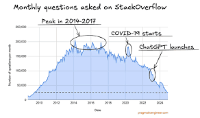
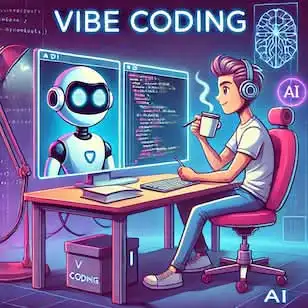
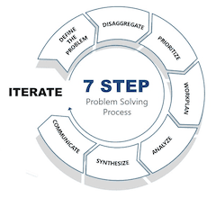
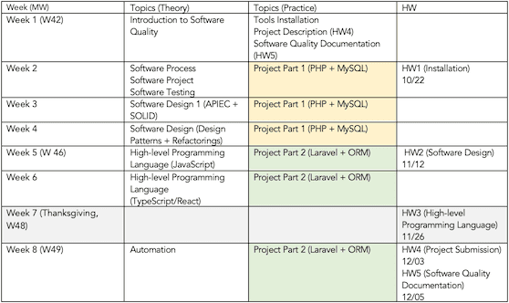

<!-- _class: lead -->
<!-- _class: frontpage -->
<!-- _paginate: skip -->

# CSC 640 Software Quality

The Story

---

> Students will learn to "manage complex software projects" by creating **effective documentation**, planning **feature deliverables**, analyzing **development resources**, assessing **quality metrics**, and enhancing **software artifacts** through "refinements".

We will discuss how we can build high-quality software artfacts by managing complexity and through refinements (refactoring).

---

> CSC 500 Object-Oriented Programming (3 credits)  OR some combination of CSC 260 Object-Oriented Programming I, CSC 360 Object-Oriented Programming II, and CSC 364 Data Structures and Algorithms

We assume that students already understand OOP and its principles

---

## Before we start

1. Download **VSCode**  
   <https://code.visualstudio.com/Download>

2. Install [**Marp for VSCode** extension](https://marketplace.visualstudio.com/items?itemName=marp-team.marp-vscode)

3. Go to **NKU ASE GitHub repo**  
   <https://github.com/nkuase/ASE/tree/main/ase_onboard>  
   - Read PDFs, download `.md` files  
   - Use VSCode Marp extension to view or convert to **PDF / PPT / HTML**

---

### Three Main Tools for ASE (Applied Software Engineering)

1. VSCode - You already downloaded it.
2. GitHub/Git - You already downloaded from it.
3. Markdown - You already download Marp (for presentation), and you will use Hugo (for github.io).

> Even though this is a CSC course, we will use ASE tools and rules extensively.

---

## CSC 640 - The Story Telling

1. SWE (Software Engineering) is about problem solving, not coding, not programming.
2. Software engineers' job has always been interpreting problems in a real-world domain into technology domain (software) to provide optimal solutions.
3. Software engineers use software skills to provide the solutions to clients' real-world problems.

---

This has always been true since the invention of a computer when programming was wiring:

or key punching:

---

Not much has changed when programming was copying others' code from stackoverflow.com.

even when AI does all the coding:

Nothing fundamental changed.

---

- The focus has never been "making code".
- It always has been "providing solutions" by "solving clients' problems", we just had to make code to accomplish the goal
- And even we don't have to make code manually anymore.

---

### The Essence of SWE

We are professional software engineers:

1. We build software for clients who pay us to make software.
1. We can make the software for us to make the software better: we call them utility software.
1. We do not make software for fun (we call them amateurs), we make software that solves clients' problems as a job.
1. Only the high-quality software will survive and can get paid.

---

### Who are our clients

1. Your bosses
2. Product owners
3. Real clients who pay to use our software
4. (In rare cases) Yourself

The people who should make happy.

---

## How to Make Clients Happy?

It's simple:

1. We promise to deliver software
2. We agree upon artifacts & schedule
3. We keep building the software according to the plan
4. We ship the software on time within budget (let alone high-quality software)

---

### However, it is not easy, it is (extremely) hard

- Around 66% of software projects fail in terms of being over budget, late, or lacking required features and functions (often cited from the Standish Group’s CHAOS report)
- About 12% to 19% of projects are classified as complete failures (canceled, or never used), while only around 30-35% are delivered successfully as intended.
- Clients will be angry and frustrated!

---

### Why?

1. Complexity
2. Unknown unknowns
3. Human factors

 

> We are talking about real-world high-quality professional software that people would pay to use, not toy programs, prototypes, or vaporware

---

### Complexity

Software is the most complicated entity that humans ever invented.

**Apollo Project**

- **Complexity:**  
  - ~ **3 million parts** in the Saturn V rocket  
  - ~ **2.5 million parts** in the Command + Service + Lunar modules  

---

**Linux Kernel**

- **Modern open-source OS kernel**  
- **Size:** ~ **40M LOC** (Linux 6.14, 2025)  
- Doubled in last decade  
- Includes code, docs, drivers, build system  
- Developed by **thousands** of contributors worldwide

---

**Microsoft Windows**

- **Commercial OS for billions of users**  
- **Windows 10:** ~ **50M LOC**  
- Includes GUI, kernel, drivers, services  
- Proprietary; exact count not public  
- Must support decades of backward compatibility

---

### Unknown unknowns

- In software engineering, **"unknown unknowns"** are factors we fail to anticipate.  
- They increase **complexity**, risk, and cost.  
- Often emerge during scaling, integration, or long-term maintenance.

---

We don't know what we don't know until we start working on it.

1. **Changes**  
2. **Coupling**  
3. **Compatibility**  
4. **Concurrency**  
5. **Configuration**  
6. **Communication**  
...

---

### Human factors

- Software is built **by people, for people**.  
- Human factors amplify **complexity** and make shipping on time within budget difficult.  
- Unknown unknowns often arise from **social, organizational, and psychological** dynamics.

---

### Definition of SWE

- SWE is about the tools and rules to **build** and **deliver** the software that clients request on time within budget in a team.
- If SWE is a game, the name of the game is "managing complexity."
- In SWE, we must manage complexity to solve problems effectively.

---

## Software Engineers

- Software engineers are problem solvers.
  - The problem is given to us by clients.
- Software engineers solve problems by "managing complexity".
  - The main cause of the problem is "changes"
- Software engineers solve SWE problems in a team.
  - It adds another layer of complexity from human factors.

---

### Rules & Tools

- Software engineers use **rules** to solve problems by managing complexity:
- Software engineers use **tools** to solve problems by managing complexity:
- They accumulate a set of rules and tools over the years.
  - They become experts as they expand their skill sets for solving problems by managing complexity.

---

## High-Quality Software (HQS)

Even though software engineers can manage complexity and solve problems, they must provide high-quality software.

- Only the software engineers who can make high-qaultiy can win the fierce competition.
- Who would buy low-quality product?

---

### Definition of HQS

> High-quality software is the software that consistently meets or exceeds **user expectations** while remaining **reliable**, **maintainable**, and **efficient** throughout its lifecycle.

It is judged not only by whether it runs correctly but also by how well it balances multiple quality attributes such as reliability, maintainability, and efficiency.

---

Now, we need to ask the question:

**How can we (software engineers) use SWE (Software Engineering) to build and deliver HQS (High-Quality Software)?**

- What topics do we need to learn?
- What rules and tools should we use?

---

## CSC 640 as the Answer

In this course, we discuss how we can deliver high-quality software on time within budget.

The Goal:

- We learn SWE rules and tools for building and shipping high-quality software products on time within budget.

---

To attaint the Goal:

- We need to understand rules.
- We need to understand tools.

We also need to do project to learn how to use the rules and tools in a real-world:

- We need to build a PHP based REST API server side applications with JavaScript front end app.

---

### The Rules

KISS (Keep It Simple and Stupid) is #1 SWE rule.

**Application**

1. We make this course as simple as possible.
    - Five assignments (1000 points)
    - No exams

---

No Surprises (NS) is #1 team rule.

**Application**

1. We set a plan, and follow the plan.
   1. We have syllabus & schedule.
   2. We discuss topics as planned.
   3. Homework is mainly about reading and/or doing using tools.

---

We will discuss more rules:

- DRY (Don't Repeat Yourself)
- Buy, don't build
- 80/20
...

---

### The Tools

We already discussed three tools: VSCode, Markdown, and GitHub; but we have more, including:

- Programming Language
  - Python for Design Patterns
  - PHP/MySQL for Backend applications
  - JavaScript/TypeScript/React for Frontend applications

---

- Automation
  - Docker
  - Bash script
  - GitHub & GitHub Actions/Hook
- Documentation
  - Hugo (Markdown/Web pages)
  - Marp (Markdown/Presentation)
  - GitHub.io

---

## Grading

### Assignments

Students have five assignments:

1. Make ready (HW1)
2. Software Design (HW2)
3. High-level Programming Language (HW3)
4. Project Submission (HW4)
5. Software Quality Documentation (HW5)

---

**Make ready (HW1)**

- Install CSC 640 tools
- Understand SWE, Project, and High Quality Software by reading ASE documents.

**Software Design (HW2)**

- Understand OOP, UML, APIEC, SOLID, Design Patterns, and Refactorings by reading and solving ASE documents.

---

**High-level Programming Language (HW3)**

- Understand JavaScript/Node.js, TypeScript, and React by making simple examples

---

**Project Submission (HW4)**

- Making REST API server-side applications using low-level PHP and high-level Laravel.
- Or students can choose a software to build, and build the software (requires one-on-one meeting).

**Software Quality Documentation (HW5)**

- Making and publishing a Marp/Hugo document about Software quality over the semester.

---

### Schedule (Tentative)

---

### Resources

- All the course related lectures/code/questions are in github.com
  - <https://github.com/nkuase/csc640>
  - <https://github.com/nkuase/ASE>
- All the course related assignments, schedule, syllabus are in Canvas
