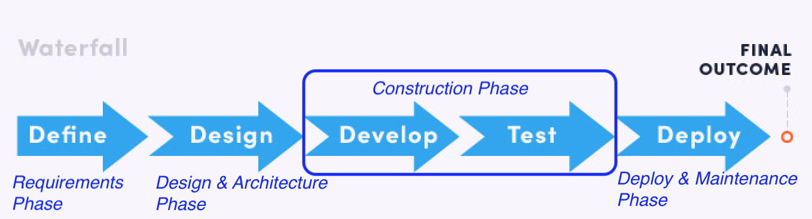
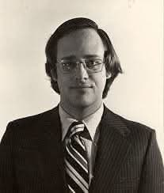
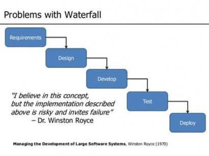
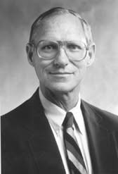
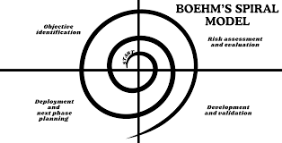
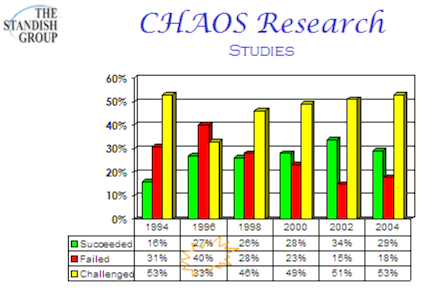
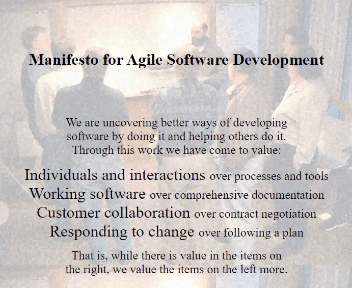
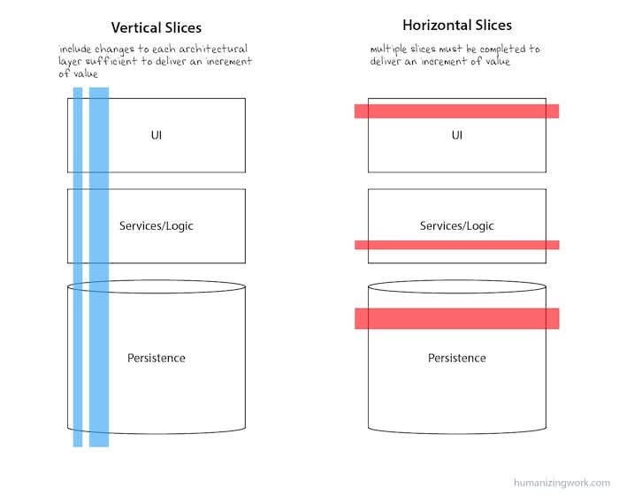

<!-- _class: lead -->
<!-- _class: frontpage -->
<!-- _paginate: skip -->

# Software Process

The Struggle to Manage Complexity: Waterfaull to Agile Process

---

## The Invention of Software Process

- The Problem: Massive Project Failures in the 1960s
- The Cause of the Problem: Software systems became increasingly **large**, **complex**, and difficult to **manage**.

Software engineers began to recognize the growing challenges of managing software complexity.

---

<style>
.columns {
  display: flex;
  gap: 1rem;  
}
.column.text {
  flex: 6;
}
.column.image {
  flex: 4
}
</style>

<div class="columns">
  <div class="column image">


  </div>
  <div class="column text">

- Problems included missed deadlines, cost overruns, unreliable systems, and maintenance nightmares.
- This led to the first NATO Software Engineering Conference (1968).
  </div>

</div>

---

### Waterfall Process Model

- The Proposed Solution: Waterfall Model
- The Idea: Hardware Engineering
- By: Winston W. Royce, who described it in his 1970 paper titled "Managing the Development of Large Software Systems."

Manufacturing had clear phases (design → prototype → production), why not software?

---

- The Idea: In this model, we (1) define, (2) design, (3) develop (and test), and (4) test software.



---

### SE Rules Applied - Process

- Divide and Conquer
- SRP (Single Responsibility Principle)
- Only Fools Rush In: We don't construct unless we know what to construct: Requirements and Architecture/Design are required to know what to construct.

What else?

---

### The Attraction (Success) of the Waterfall Model

The Waterfall model appeared attractive because it promised **structure and control** through:

- Clear phases (Requirements → Design → Implementation → Testing → Maintenance)
- Detailed documentation at each stage
- Management checkpoints and approvals
- Predictable timelines and budgets

---

Even though the Waterfall model was **widely used** from the 1970s through the early 2000s, it ultimately proved to be ineffective for most large and changing software projects.

We should notice that:

- Waterfall did succeed (and still now) in some contexts (e.g., military or safety-critical systems)
- It couldn't handle changing requirements or iterative feedback, which led to the rise of Agile methods in the 1990s–2000s.

---

### Why the Waterfall Model Struggled to Manage Real-World Complexity?

#### 1. Requirements **Change**

Linear Thinking ≠ Complex Reality

```txt
Waterfall Assumption:        Reality:
A → B → C → D               A ↔ B
                            ↕   ↕
                            D ↔ C
```

By the time you finish a 2-year waterfall project, the world & requirements has changed!

---

#### 2. "Big Bang" Integration

- Modules developed separately for months
- Integrated only at the end
- Result: **Integration Hell** - components don't work together
- Example: Team A's login module expects JSON, Team B's database returns XML

---

#### 3. Late Testing = Expensive Disasters

- You don't test until the end, so you discover problems when it's most expensive to fix.

Cost Multiplier: **Compounding Errors**

Fix a bug in the requirements phase: $1
Fix a bug in the design phase: $10
Fix a bug in the coding phase: $100
Fix a bug in the testing phase: $1,000
Fix a bug after deployment: $10,000+

---

#### 4. No Feedback Loops

```txt
Waterfall: Requirements → [BLACK BOX] → Final Product
```

- Complexity requires **continuous learning**
- Waterfall provides **no mechanism to learn and adapt**

---

### The Fundamental Flaw of the Waterfall Model (The Confusion of complicated vs complex)

- Waterfall treats software like a **complicated** problem (like building a bridge) when it's actually a **complex** problem (like managing an ecosystem).
- Complex problems require iterative exploration, not upfront planning.

Software engineers learned it the hard way.

---

<!-- _backgroundColor: mintcream -->

### Complicated vs. Complex

#### The complicated: something that has many parts

- It can be challenging because of the number of components involved.
- It is ultimately knowable and can be figured out, often by experts using analysis, decomposition, or expertise.
- Complicated systems tend to have solutions that can be identified or engineered by breaking down the problem into manageable parts.

---

<!-- _backgroundColor: mintcream -->

#### The complex: something inherently unpredictable and difficult to fully understand or control from changes

- Complexity arises from interdependencies, emergent behaviors, and dynamic interactions.
- It defies simple cause-and-effect reasoning and often reveals "unknown unknowns" only in hindsight.
- Complex systems demand adaptive, iterative, and holistic approaches—not rigid, linear processes.

---

### Real Example of the Waterfall Model Failure

The FBI's Virtual Case File project (2000-2005):

- Cost: $170 million
- Result: Completely abandoned
- Why?: They followed waterfall, built everything, then discovered it didn't work and couldn't meet actual FBI agent needs

Perfect plan and implementation to get horrible results following the waterfall model

---

### The Irony of the Waterfall Model

<style>
.columns {
  display: flex;
  gap: 2rem;  
  align-items: center;
}
.column.text {
  flex: 6;
}
.column.image {
  flex: 4;
}
</style>

<div class="columns">
  <div class="column image">



  </div>
  <div class="column text">

- Royce was actually critical of it.
- In his paper, Royce presented this sequential approach (requirements → design → implementation → testing → maintenance)

  </div>

</div>

---



- Then, spent most of the paper explaining why this approach was **risky** and suggesting improvements including:
  - Iterative development
  - Prototyping
  - User involvement throughout the process

<!--
* Software engineers just used his waterfall idea, without considering the risks involved.
* He already know the issues and even the solutions, but software engineers just misinterpreted his ideas.*
-->

---

#### The Lessons Learned from the Waterfall Model

> Structure alone doesn't manage **complexity**—you need **adaptive** processes with fast feedback loops!

<BR/>

Now, we understand the goal is to `manage complexity`, not `complication`, but how?

---

## The Spiral Model (1986)

<style>
.columns {
  display: flex;
  gap: 1rem;  
}
.column.text {
  flex: 7;
}
.column.image {
  flex: 3;
}
</style>

<div class="columns">
  <div class="column image">



  </div>

  <div class="column text">

- Barry Boehm proposed the **Spiral Model**, the first major alternative to the Waterfall approach.  
- The Spiral Model emphasized (1) **iterative development** and (2) **continuous risk evaluation** at every stage.

</div>

</div>

---



- He managed risks continuously throughout each cycle.
- His model blended Waterfall’s structure with iterative flexibility.

---

### Versioning Reflects the Spiral Model

The version naming convention (e.g., DOS 3.1 → 3.2, Windows 10 → 11) illustrates Barry Boehm’s **Spiral Model** principles:

<BR/>

- Each version marks a new iteration.
- Teams evaluate risks and improvements each cycle.
- Software evolves continuously, not in a single release.

---

### The Problem: Spiral Was Better, But Still Not Enough

**What Spiral Fixed:**

✅ Risk management
✅ Iterative development
✅ Early prototyping

**What Spiral Didn't Fix:**

❌ Still heavy on documentation
❌ Still required extensive planning
❌ Still slow to respond to change
❌ Still process-heavy, not people-focused

---

## The 1990s: Growing Frustration

**Software Industry Problems:**

1. Projects Still Failing

<style>
.columns {
  display: flex;
  gap: 2rem;  
  align-items: center;
}
.column.text {
  flex: 5;
}
.column.image {
  flex: 5;
}
</style>

<div class="columns">
  <div class="column image">



  </div>

  <div class="column text">

- Standish Group (1994)
  - Only 16% of projects succeeded
  - 53% were over budget/late
  - 31% were cancelled  

  </div>

</div>

---

2. Market Speed Changed
   - Internet boom demanded faster delivery
   - 6-month spirals too slow for web applications

3. Developer Burnout
   - Too much documentation
   - Too little coding
   - Rigid processes killed creativity

**Why? What is missing?**

---

### The Missing Ingredient: People Over Process

Boehm focused on **RISK**

However, we need the model that would focus on **PEOPLE**.

```txt
Spiral Model:
  "How do we reduce technical risk?"

People-Focused Model:
  "How do we empower people to build 
   what customers actually need?"
```

---

### The Path to Agile: Key Milestones

#### 1. Rapid Application Development (RAD) - 1991

- James Martin
- Focus: Build fast, iterate faster
- Introduced: Time-boxing (fixed deadlines)

#### 2. Scrum - 1995

- Jeff Sutherland & Ken Schwaber
- Rugby metaphor: Self-organizing teams
- Introduced: Sprints, Daily standups

---

#### 3. Extreme Programming (XP) - 1996

- Kent Beck
- Focus: Technical excellence
- Introduced: Pair programming, TDD, Continuous Integration

#### 4. Feature-Driven Development - 1997

- Jeff De Luca with contributions from Peter Coad
- Focus: Short iterations delivering features

---

## February 2001: The Agile Manifesto

**17 Software Developers met in Snowbird, Utah**

Including:

- Kent Beck (XP)
- Jeff Sutherland (Scrum)
- Martin Fowler (Refactoring)
- Robert C. Martin (Uncle Bob)
- And 13 others

**Mission:** Find common ground between their methodologies

---



---

## Comparing the Models

| Aspect             | Spiral             | Agile                 |
|--------------------|--------------------|-----------------------|
| **Focus**          | Risk management    | Customer value        |
| **Cycle Length**   | Months             | Weeks (1-4)           |
| **Documentation**  | Heavy              | Minimal (just enough) |
| **Team Structure** | Role-based         | Self-organizing       |
| **Planning**       | Extensive upfront  | Adaptive              |
| **Customer**       | Reviews iterations | Embedded in team      |

---

### Key Philosophical Shift (From RISK to HUMAN)

#### 1. Spiral Model Mindset:

```txt
Plan → Analyze Risk → Build → Review → Replan
(Focus: "What could go wrong?")
```

#### 2. Agile Mindset:

```txt
Collaborate → Build Small → Get Feedback → Adapt
(Focus: "What creates value?")
```

---

### Veritcal Slice vs. Horizontal Slice



---

### Example: Building an E-commerce Site

#### 1. Spiral = Horizontal Slice (Layer-by-Layer)

```txt
Month 1-2: Plan everything
Month 3-5: Build all layers horizontally
  
     ┌─────────────────────────────────────┐
     │ Products │ Cart │ Checkout │ Mobile │ ← UI Layer
     ├─────────────────────────────────────┤
     │ Products │ Cart │ Checkout │ Mobile │ ← API Layer
     ├─────────────────────────────────────┤
     │ Products │ Cart │ Checkout │ Mobile │ ← DB Layer
     └─────────────────────────────────────┘
          ↓
Month 6: Integration + Customer sees it first time
  - Customer: "This isn't what we wanted!"
  - 6 more months to fix
```

❌ **Problem**: Nothing works end-to-end until month 6. Late feedback. High risk.

---

#### 2. Agile = Vertical Slice (Feature-by-Feature)

```txt
Sprint 1:   Sprint 2:   Sprint 3:   Sprint 4:
┌────────┐ ┌────────┐ ┌────────┐ ┌────────┐
│Product │ │  Cart  │ │Checkout│ │ Mobile │
├────────┤ ├────────┤ ├────────┤ ├────────┤
│   UI   │ │   UI   │ │   UI   │ │   UI   │
│  API   │ │  API   │ │  API   │ │  API   │
│   DB   │ │   DB   │ │   DB   │ │   DB   │
└────────┘ └────────┘ └────────┘ └────────┘
    ↓          ↓          ↓          ↓
 ✓ Works   ✓ Works   ✓ Works   ✓ Works
  Deploy    Deploy    Deploy    Deploy
  
Customer gives feedback after each sprint and adjusts priorities!
```

✅ **Benefit**: Working feature every 2 weeks. Early feedback. Low risk.

---

#### Key Differences:

|                           | Spiral (Horizontal)               | Agile (Vertical)                |
|---------------------------|-----------------------------------|---------------------------------|
| **Build**                 | All features, one layer at a time | One feature, all layers at once |
| **First working feature** | Month 6                           | Week 2                          |
| **Customer feedback**     | After 6 months                    | Every 2 weeks                   |
| **Risk**                  | High (big bang integration)       | Low (incremental)               |

---

#### Simple Analogy:

- **Horizontal**: Build foundation for entire house → frame entire house → finish entire house
  - *Can't use any room until everything is done*

- **Vertical**: Build complete kitchen → build complete bedroom → build complete bathroom
  - *Use the kitchen while building the bedroom!*

---

### Why Agile Succeeded Where Spiral Couldn't

#### 1. **Speed to Market**

- Spiral: Months per iteration
- Agile: Working software every 1-4 weeks

#### 2. **Real Feedback**

- Spiral: Prototypes and reviews
- Agile: Real users with real software

#### 3. **Adaptability**

- Spiral: Change requires new spiral
- Agile: Change every sprint

---

### 4. **Team Empowerment**

- Spiral: Architects analyze risk, developers build
- Agile: Self-organizing teams make decisions

### 5. **Less Waste**

- Spiral: Extensive documentation and analysis
- Agile: Just enough, just in time

### 6. **Continuous Delivery**

- Spiral: Big releases after each spiral
- Agile: Small releases continuously

---

### The Technical Practices That Made Agile Possible

**XP's Technical Innovations:**

1. **Test-Driven Development (TDD)**

   ```python
   # Write test first
   def test_shopping_cart():
       cart = ShoppingCart()
       cart.add_item("Book", 10.00)
       assert cart.total() == 10.00
   
   # Then write code to pass the test
   class ShoppingCart:
       def add_item(self, name, price):
           self.items.append((name, price))
   ```

---

2. **Continuous Integration (CI)**
   - Code integrated multiple times per day
   - Automated tests run on every commit
   - Problems found within minutes, not months

3. **Pair Programming**
   - Two developers, one computer
   - Continuous code review
   - Knowledge sharing

4. **Refactoring**
   - Constantly improve code structure
   - Enabled by automated tests
