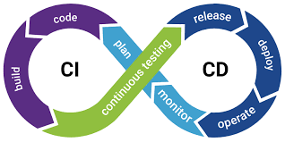

<!-- _class: lead -->
<!-- _class: frontpage -->
<!-- _paginate: skip -->

# The Scrum Framework and DevOps

The Most Popular Agile Process

---

## Agile vs Scrum

### Scrum: Modern Agile Framework

#### 1. Agile = Philosophy

**What and Why**

- Respond to change
- Customer collaboration
- Working software
- Individuals over processes

*Abstract principles - no specific "how"*

---

#### 3. Scrum = Framework

**How to do it**

- 2-week sprints
- Daily standup (15 min)
- Sprint planning/review/retro
- Roles: PO, SM, Team

*Concrete practices - specific "how"*

---

#### 3. The Relationship

```txt
     Agile (Philosophy)
          ↓
   ┌──────┼──────┐
   │      │      │
 Scrum  Kanban   XP (Framework)
```

**You do Scrum to be Agile**  
(Like you write Java to practice OOP)

---

## Scrum: Most Popular Agile Framework (2024: 87% of agile teams)


---

### Scrum Roles

**Product Owner**

- Represents customer/business
- Manages product backlog
- Prioritizes features

**Scrum Master**

- Facilitates process
- Removes obstacles
- Protects team from interruptions

---

**Development Team**

- Self-organizing
- Cross-functional
- 5-9 members typically

**Stakeholders**

- Any people, including users or clients, who are involved in any of the Scrum activities.

---

### Scrum Terminology

#### 1. Scrum Value

- Value is what Scrum teams aim to deliver.
- It's often a software product or artifact, but can be anything meaningful in the given context.


---

#### 2. Scrum Backlogs

- Product Backlog: A prioritized list of work or "to-do list" for the **Project**, with top items delivered first.
- Sprint Backlog: The Developers' plan or "to-do list" for the **Sprint**.
- Items in the Product Backlog is selected into the Spring Backlog through **Project Planning**.


---

#### 3. Scrum Increment

- Increment: The total of all Product Backlog items completed in the current and previous Sprints.
- Teams refine the **Product Backlog** based on the **Increment** during the **Sprint Review**.


---

#### 4. Scrum Planning & Daily Scrum

<style>
.columns {
  display: flex;
  gap: 2rem;  
  align-items: center;
}
.column.text {
  flex: 5;
}
.column.image {
  flex: 5;
}
</style>

<div class="columns">
  <div class="column image">


  </div>

  <div class="column text">

**1. Sprint Planning** (Start of sprint)

- What will we build?
- How will we build it?

**2. Daily Scrum** (Every day, 15 minutes)

- What did I do yesterday?
- What will I do today?
- Any blockers?
  
  </div>

</div>  

---

#### 3. Sprint Review & Retrospective at the end of the Sprint

<style>
.columns {
  display: flex;
  gap: 0rem;  
  align-items: center;
}
.column.text {
  flex: 4;
}
.column.image {
  flex: 6;
}
</style>

<div class="columns">
  <div class="column image">


  </div>

  <div class="column text">

**Sprint Review**

- Demo to stakeholders
- Get feedback

**Sprint Retrospective**

- What went well?
- What can improve?

  </div>

</div>  

---

### Overall Perspective of Scrum


- We plan, demo (Review), and think (Retrospective) per Sprint
- We make todo (for the whole Product & Sprint) and done (Increment) list.
- At the end of the Semester, we update todo lists through demo & think.

---

**Sprints from Software Engineers Perspective**


- We are given Sprint Backlog (todo).
- We keep making Increment through define, design, develop (test), and deploy.
- We demo (review) and think (retrospective) what we accomplished in this Sprint.
- We update Product backlog from the review and Sprint backlog from the retrospective.

---

### Real-World Success

#### 1. Spotify

**2008: Small startup using Scrum**

- 2-week sprints
- Cross-functional teams

**2010: Scaled to "Spotify Model"**

- Squads (small teams), Tribes (groups of squads), Chapters (communities of practice), Guilds (knowledge sharing)

**Result:**

- 300+ teams releasing features daily through continuous innovation

---

#### 2. Real-World Success: Amazon

**Before Agile (1990s):**

- Monolithic application
- Quarterly releases
- High failure rate

**After Agile (2000s):**

- Microservices
- Two-pizza teams (5-9 people)
- Deploy every 11.7 seconds (2015)

**Quote:** "You build it, you run it" - Werner Vogels, CTO

---

## The Comparisons: Agile vs Traditional (Waterfall/Spiral)

**2024 Industry Statistics:**

| Metric                | Traditional | Agile |
|-----------------------|-------------|-------|
| Success Rate          | 29%         | 64%   |
| On-time Delivery      | 44%         | 71%   |
| Within Budget         | 56%         | 78%   |
| Customer Satisfaction | 61%         | 87%   |
| Team Morale           | Low         | High  |

*Source: Project Management Institute, 2024*

---

### What Spiral Taught Us, What Agile Added

#### 1. From Spiral Model:

✅ Iterative development
✅ Risk awareness
✅ Prototyping
✅ Customer involvement

#### 2. What Agile Added:

➕ Shorter iterations (weeks, not months)
➕ Self-organizing teams
➕ Technical excellence practices
➕ Embrace change as normal
➕ Continuous delivery (CD)
➕ People over process

---

### Why Both Still Matter

#### 1. When to Use Spiral-like (Waterfall/Spiral) Approaches:

- High-risk projects (aerospace, medical devices)
- Regulatory requirements
- Hardware-software integration
- When upfront risk analysis is critical

---

#### 2. When to Use Agile:

- Software products
- Uncertain requirements
- Need for fast feedback
- Innovation and experimentation
- Most modern software projects

---

### The Hybrid Approach: Scaled Agile

**Many organizations use "Agile at scale":**

- **SAFe** (Scaled Agile Framework)
  - Agile teams + enterprise planning
  - Program Increments (PI) ~ modern spirals!

- **LeSS** (Large-Scale Scrum)
  - Multiple Scrum teams
  - Coordinated sprints

**Key Insight:** Modern approaches combine best of both worlds

---

## Modern Evolution: DevOps (2009+)

**Agile focused on development, but...**

- Operations still separate
- Deployment still manual
- "Throw it over the wall" mentality

---

**DevOps:** Extend agile to operations


- Continuous Integration → Continuous Deployment (CI/CD Pipeline)
- Infrastructure as Code
- Automated testing and deployment
- Development and Operations collaborate

---

### DevOps Key Concept 1: CI/CD Pipeline

</BR>



---

**Continuous Integration → Continuous Deployment**

```txt
Developer → Git Push → CI → Tests → CD → Production
   ↓          ↓        ↓      ↓      ↓       ↓
 Write     Commit   Build  Auto   Deploy  Live!
 Code               Test   Test
         
Minutes, not months!
```

**CI**: Merge code frequently, test automatically  
**CD**: Deploy to production automatically

**Example**: Push code at 9 AM → Live in production by 9:05 AM

---

### DevOps Key Concept 2: Infrastructure as Code

**Treat servers like code**

**Traditional Way** (Manual): ❌ Hard to reproduce, error-prone

```txt
1. Click AWS console
2. Create server manually
3. Install software by hand
4. Configure settings
```

---

**DevOps Way** (Code): ✅ Run script → Infrastructure created!

**Infrastructure as Code** (Write & Run):

- Write a config file
- Run one command
- Server created automatically
- Takes minutes, repeatable

---

#### Real Example 1: Terraform for AWS

```hcl
# main.tf
resource "aws_instance" "web" {
  ami           = "ami-12345"      # Ubuntu image
  instance_type = "t2.micro"       # Server size
  
  tags = {
    Name = "WebServer"
  }
}
```

**Run:** `terraform apply`  
**Result:** AWS server created!

---

#### Real Example 2: Docker Compose

```yaml
# docker-compose.yml
services:
  web:
    image: nginx
    ports:
      - "80:80"
  
  app:
    image: node:18
    volumes:
      - ./code:/app
```

**Run:** `docker-compose up`  
**Result:** Web server + Database + App running instantly!

---

#### What This Does

```txt
One Command:
  docker-compose up
       ↓
┌─────────────────┐
│  Nginx (web)    │ Port 80
├─────────────────┤
│  PostgreSQL (db)│ 
├─────────────────┤
│  Node.js (app)  │
└─────────────────┘
All Running!
```

**Benefit**: Share this file → Anyone can run your exact environment

---

## Docker vs Traditional

| Traditional                 | Docker            |
|-----------------------------|-------------------|
| Install Nginx manually      | `image: nginx`    |
| Install PostgreSQL manually | `image: postgres` |
| Configure ports manually    | `ports: "80:80"`  |
| Takes hours to setup        | Takes 30 seconds  |

**Docker = Infrastructure as Code for applications**

---

## DevOps Key Concept 3: Automated Testing & Deployment

**No manual steps in DevOps!**

<style>
pre {
  font-size: 0.5em;
}
</style>

```txt
Code Change
    ↓
┌─────────────────────┐
│ Automated Pipeline  │
├─────────────────────┤
│ 1. Unit Tests       │ ✓ Pass
│ 2. Integration Tests│ ✓ Pass
│ 3. Security Scan    │ ✓ Pass
│ 4. Build Docker     │ ✓ Done
│ 5. Deploy to Staging│ ✓ Done
│ 6. E2E Tests        │ ✓ Pass
│ 7. Deploy to Prod   │ ✓ Done
└─────────────────────┘
    ↓
Live in Production (All Automatic!)
```

**Traditional**: Days of manual work  
**DevOps**: 10 minutes, zero human intervention

---

## DevOps Key Concept 4: Dev & Ops Collaborate

**Breaking down the wall**

<style>
pre {
  font-size: 0.5em;
}
</style>

**Before DevOps**:

```txt
Developers          Operations
    │                   │
    │ "It works on     │
    │  my machine!"    │
    ├──────────────────┤ ← The Wall
    │                   │
    │               "Can't deploy,
    │                not my problem"
    
❌ Conflict, delays, finger-pointing
```

**With DevOps**:

```txt
   Dev + Ops Team
         │
    Shared goals
    Shared tools
    Shared responsibility
    
✅ Collaboration, fast delivery
```

**Result**: "You build it, you run it" mentality

---

## The Software Process Evolution Timeline

```txt
1970: Waterfall
       ↓ (Too rigid, late feedback)
1986: Spiral Model
       ↓ (Too heavy, still slow)
1991-1999: Various Agile Methods
       ↓ (Fragmented approaches)
2001: Agile Manifesto
       ↓ (Unified principles)
2009: DevOps
       ↓ (Operations integration)
2020s: AI-Assisted Development
       (Next evolution?)
```

---

## Lessons We Learned in Software Process

**1. Processes Evolve for Reasons**

- Each model solved real problems
- Each created new problems
- Understanding history helps choose right approach

**2. No Silver Bullet**

- Waterfall: Great for construction
- Spiral: Great for high-risk projects
- Agile: Great for software products
- Choose based on context!

---

**3. People > Process**

- Best process with wrong team = failure
- Simple process with great team = success
- Agile recognized this first

**4. Technical Practices Matter**

- Can't be agile without automation
- Testing, CI/CD, refactoring enable speed
- Process + practices = success

---

### Key Principles to Remember

**From Spiral Model:**

- Manage risk systematically
- Build prototypes to validate
- Get feedback early and often

**From Agile:**

- Deliver working software frequently
- Welcome changing requirements
- Empower self-organizing teams
- Reflect and adjust regularly
