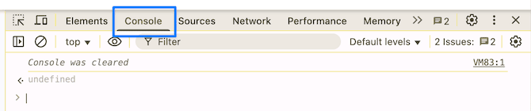
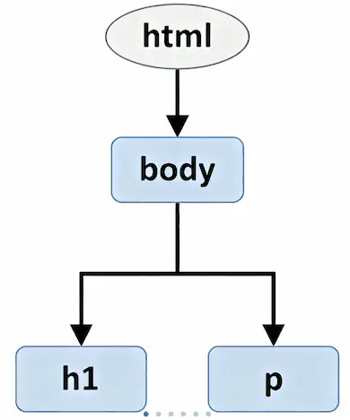

<!-- _class: lead -->
<!-- _class: frontpage -->
<!-- _paginate: skip -->

# JavaScript Tutorial

## From Basics to Real Applications

---

## Introduction

- As we learned from Sarah's journey, JavaScript transformed web development by providing a high-level language that makes programming accessible and productive.
- This tutorial will teach you JavaScript fundamentals through practical examples.

---

## What is JavaScript?

JavaScript is a **high-level**, **interpreted** programming language that runs in web browsers and servers (Node.js).

Unlike C (which Sarah struggled with), JavaScript provides:

- **Automatic memory management** - No malloc/free!
- **Dynamic typing** - Variables can hold any type
- **First-class functions** - Functions are values
- **Event-driven programming** - Perfect for user interfaces

---

### Your First JavaScript Program

```javascript
// This is a comment
console.log("Hello, World!");

// Let's see why JavaScript is "high-level"
const message = "Welcome to JavaScript!";
console.log(message);
```

---

**Try it:**

1. Use Chrome as your main browser.
1. Open your browser's console
   1. View -> Developer -> View Console
   2. F12 or Cmd-option-i (Mac)
2. ype these lines!



---

## Basic Syntax and Variables

### Variables: Three Ways to Declare

```javascript
// 1. const - for values that won't change (preferred)
const pi = 3.14159;
const universityName = "CSC640 University";

// 2. let - for values that will change
let score = 0;
let currentUser = "Student";

// 3. var - old way (avoid in modern code)
var oldStyle = "Don't use me!";
```

---

### Why const and let over var?

```javascript
// Problem with var - no block scope
if (true) {
    var leaked = "I'm visible outside!";
    let contained = "I'm only visible inside";
    const alsoContained = "Me too!";
}

console.log(leaked);        // Works (bad!)
console.log(contained);     // Error (good!)
console.log(alsoContained); // Error (good!)
```

---

## Data Types

JavaScript has **dynamic typing** - variables can hold any type:

### Primitive Types

```javascript
// 1. Number (integers and decimals)
const age = 25;
const gpa = 3.85;
const negative = -42;

// 2. String (text)
const firstName = "Sarah";
const lastName = 'Johnson';  // Single or double quotes
const fullName = `${firstName} ${lastName}`; // Template literal
```

---

```javascript

// 3. Boolean
const isStudent = true;
const hasGraduated = false;

// 4. Undefined (no value assigned)
let futureValue;
console.log(futureValue); // undefined

// 5. Null (intentionally empty)
let emptyOnPurpose = null;

// 6. Symbol (unique identifier)
const uniqueId = Symbol('id');
```

---

### Type Checking

```javascript
console.log(typeof 42);       // "number"
console.log(typeof "Hello");  // "string"
console.log(typeof true);     // "boolean"
console.log(typeof undefined);// "undefined"
console.log(typeof null);     // "object" (historical bug!)
console.log(typeof {});       // "object"
console.log(typeof []);       // "object" (arrays are objects)
```

---

## Functions

Functions are the building blocks of JavaScript programs:

### Function Declaration

```javascript
// Traditional function
function greetStudent(name) {
    return "Hello, " + name + "!";
}

console.log(greetStudent("Alice")); // "Hello, Alice!"
```

---

### Function Expression

```javascript
// Function stored in a variable
const calculateGrade = function(score, total) {
    const percentage = (score / total) * 100;
    return percentage;
};

console.log(calculateGrade(85, 100)); // 85
```

---

### Arrow Functions (Modern Way)

```javascript
// Short syntax for functions
const add = (a, b) => a + b;

// With multiple lines
const getLetterGrade = (percentage) => {
    if (percentage >= 90) return 'A';
    if (percentage >= 80) return 'B';
    if (percentage >= 70) return 'C';
    if (percentage >= 60) return 'D';
    return 'F';
};

console.log(add(5, 3));                    // 8
console.log(getLetterGrade(85));           // 'B'
```

---

### Functions as First-Class Citizens

```javascript
// Functions can be passed as arguments
const numbers = [1, 2, 3, 4, 5];

// Using a function as an argument to map
const doubled = numbers.map(num => num * 2);
console.log(doubled); // [2, 4, 6, 8, 10]

// Functions can return functions
const createMultiplier = (factor) => {
    return (number) => number * factor;
};

const double = createMultiplier(2);
const triple = createMultiplier(3);

console.log(double(5));  // 10
console.log(triple(5));  // 15
```

---

## Arrays and Objects

### Arrays - Ordered Collections

```javascript
// Creating arrays
const courses = ["Math", "Physics", "JavaScript"];
const scores = [95, 87, 92, 88];
const mixed = [42, "Hello", true, null]; // Can mix types!

// Accessing elements (0-indexed)
console.log(courses[0]);     // "Math"
console.log(courses[2]);     // "JavaScript"
console.log(courses.length); // 3
```

---

```javascript
// Common array methods
courses.push("React");       // Add to end
courses.pop();               // Remove from end
courses.unshift("HTML");     // Add to beginning
courses.shift();             // Remove from beginning

// Array methods that don't modify original
const upperCourses = 
  courses.map(course => course.toUpperCase());
const longCourses = 
  courses.filter(course => course.length > 5);
const totalScore = 
  scores.reduce((sum, score) => sum + score, 0);
```

---

JavaScript filter function filters out the input array from the filter function.

```javascript
const scores = [95, 87, 92, 88];
const longCourses = 
  courses.filter(course => course.length > 90);
// [95, 92]
```

JavaScript reduce funtion reduces its input argument

```javascript
const scores = [1,2,3,4,5];
const totalScore = 
  scores.reduce((sum, score) => sum + score, 0);
// initial sum is 0, and score is the first value of scores
// (0, 1)  => 0 + 1 : this becomes sum
// (1, 2) => 3: (3, 3) => 6: (6, 4) => 10, (10, 5) => 15
```

---

### Objects - Key-Value Pairs

```javascript
// Creating objects
const student = {
    name: "Sarah Johnson",
    age: 22,
    major: "Computer Science",
    gpa: 3.85,
    courses: ["CSC640", "MAT201", "PHY101"]
};

// Accessing properties
console.log(student.name);        // Dot notation
console.log(student["age"]);      // Bracket notation

// Modifying objects
student.gpa = 3.90;               // Update
student.email = "sarah@uni.edu";  // Add new property
delete student.age;               // Remove property
```

---

- JSON is JavaScript Object Notation, and it is based on a JavaScript Object.
- In JavaScript, we don't need the double quotation for the key.
- However, when we use JSON string, we must use quotation.

```json
// JavaScript Object
const student = {"name": "Sarah Johnson"};
const student = {name: "Sarah Johnson"};

// JSON string
const student = '{"name": "Sarah Johnson"};
```

---

- JavaScript object can have methods.
- The `this` in a JavaSCript object means the object that the method is accessing.

```javascript
// Object methods
const calculator = {
    add: (a, b) => a + b,
    multiply: (a, b) => a * b,
    
    // Method using 'this'
    numbers: [1, 2, 3],
    sum: function() {
        return this.numbers.reduce((a, b) => a + b, 0);
    }
};

console.log(calculator.add(5, 3));      // 8
console.log(calculator.sum());          // 6
```

---

This feature is similar to the class of OOP languages.

```python
# Python code
class Calculator:
  def __init__(self):
    self.numbers = [1,2,3]
  def add(self, a, b):
    return a + b
  def multiply(self, a, b):
    return a * b
  def sum(self):
    return sum(self.numbers)

print(Calculator().add(5,3))
print(Calculator().sum())
```

---

### Destructuring (Modern Feature)

```javascript
// Array destructuring
const rgb = [255, 128, 0];
const [red, green, blue] = rgb;
console.log(red);   // 255

// Object destructuring
// JavaScript matches corresponding values
const { name, gpa, major } = student;
console.log(name);  // "Sarah Johnson"

// In function parameters
const displayStudent = ({ name, major }) => {
    console.log(`${name} studies ${major}`);
};

displayStudent(student); 
// "Sarah Johnson studies Computer Science"
```

---

## Control Flow

### If/Else Statements

```javascript
const score = 85;

if (score >= 90) {
    console.log("Excellent! Grade: A");
} else if (score >= 80) {
    console.log("Good job! Grade: B");
} else if (score >= 70) {
    console.log("Not bad! Grade: C");
} else {
    console.log("Need improvement");
}

// Ternary operator (short if/else)
const passed = score >= 60 ? "Passed" : "Failed";
console.log(passed); // "Passed"
```

---

### Switch Statement

```javascript
const day = "Monday";

switch(day) {
    case "Monday":
    case "Tuesday":
        console.log("Regular classes");
        break;
    case "Wednesday":
        console.log("Lab day");
        break;
    case "Saturday":
    case "Sunday":
        console.log("Weekend!");
        break;
    default:
        console.log("Study day");
}
```

---

### Loops

```javascript
// For loop
for (let i = 0; i < 5; i++) {
    console.log(`Count: ${i}`);
}

// While loop
let countdown = 5;
while (countdown > 0) {
    console.log(`${countdown}...`);
    countdown--;
}
```

---

We have high-level JavaScript loops:

- for ... of is for iterating over values.
- for ... in is for iterating over keys
- forEach is functional style code

```javascript
// For...of (iterate over values)
const grades = [85, 92, 78, 95];
for (const grade of grades) {
    console.log(`Grade: ${grade}`);
}
// For...in (iterate over keys)
const studentInfo = { name: "Alice", age: 20, major: "CS" };
for (const key in studentInfo) {
    console.log(`${key}: ${studentInfo[key]}`);
}
// Array iteration methods (functional style)
grades.forEach((grade, index) => {
    console.log(`Test ${index + 1}: ${grade}`);
});
```

---

## DOM (Document Object Model)

- The **DOM (Document Object Model)** is a **tree-like structure** that represents everything in an HTML page.
- Each part of your webpage — text, images, buttons — becomes a **node** (object) that JavaScript can access or change.

---

### Real-World Analogy

Imagine a **house blueprint**:

- The house = the web page  
- Rooms, doors, windows = HTML elements  
- The **DOM** = digital version of that blueprint — you can **inspect** or **change** any part (move a door, paint a wall) via **JavaScript**

---

### HTML Example

<style>
.columns {
  display: flex;
  gap: 2rem;  
  align-items: center;
}
.column.text {
  flex: 6;
}
.column.image {
  flex: 4;
}
</style>

<div class="columns">
  <div class="column image">



  </div>

  <div class="column text">

```html
<!DOCTYPE html>
<html>
  <body>
    <h1>Hello World</h1>
    <p>Welcome to DOM!</p>
  </body>
</html>
```

  </div>

</div>  

Each element (like `<h1>` or `<p>`) is a node in the DOM tree.

---

### Accessing Nodes with JavaScript

DOM Tree Representation:

```txt
Document
 └── html
     └── body
         ├── h1
         │    └── "Hello World"
         └── p
              └── "Welcome to DOM!"
```

```javascript
document.querySelector("h1").innerText = "Hi from DOM!";
```

Before: Hello World

After (DOM updated dynamically): Hi from DOM!

---

## DOM Manipulation

This is why JavaScript was invented - interacting with web pages!

```html
<!DOCTYPE html>
<head>
  <title>DOM Selector Example</title>
</head>
<body>
  <h1 id="page-title">Welcome to My Page</h1>
  <p>Here are some buttons to test DOM selection:</p>
  <!-- Buttons with class "btn" -->
  <button class="btn">Button 1</button>
  <button class="btn">Button 2</button>
  <!-- A form with a submit button -->                        
  <form id="form">
    <input type="text" placeholder="Enter name" />
    <button type="submit" class="btn">Submit</button>
  </form>
</body>
</html>
```

---

### Selecting Elements

```html
  <h1 id="page-title">Welcome to My Page</h1>
```

id attribute is used to identify a unique element.

```javascript
// Get element by ID
const title = document.getElementById('page-title');
```

---

```html
  <button class="btn">Button 1</button>
  <button class="btn">Button 2</button>
```

class is used to specify multiple elements with the same attribute.

```javascript
// Get elements by class name
const buttons = document.getElementsByClassName('btn');

// Modern way: querySelector
const firstButton = document.querySelector('.btn');        // First match
const allButtons = document.querySelectorAll('.btn');     // All matches
```

---

```html
  <!-- A form with a submit button -->
  <form id="form">
    <input type="text" placeholder="Enter name" />
    <button type="submit" class="btn">Submit</button>
  </form>
```

We can specify using a multiple selector.

```javascript
// CSS-style selectors
const submitBtn = 
  document.querySelector('#form button[type="submit"]');
```

---

### Modifying Elements

```javascript
// Change text content
const heading = document.querySelector('h1');
heading.textContent = "Welcome to JavaScript!";

// Change HTML content
const container = document.querySelector('.content');
container.innerHTML = '<p>New <strong>HTML</strong> content</p>';

// Modify styles
heading.style.color = 'blue';
heading.style.fontSize = '24px';

// Add/remove CSS classes
heading.classList.add('highlight');
heading.classList.remove('old-style');
heading.classList.toggle('active');
```

---

### Creating Elements

```javascript
// Create new elements
const newTask = document.createElement('li');
newTask.textContent = "Learn JavaScript";
newTask.classList.add('task-item');

// Add to the page
const taskList = document.querySelector('#task-list');
taskList.appendChild(newTask);

// Or insert at specific position
const firstTask = taskList.firstChild;
taskList.insertBefore(newTask, firstTask);
```

---

### Event Handling

```javascript
// Click event
const button = document.querySelector('#myButton');
button.addEventListener('click', () => {
    console.log('Button clicked!');
});

// Form submission
const form = document.querySelector('#myForm');
form.addEventListener('submit', (event) => {
    event.preventDefault(); // Stop default form submission
    console.log('Form submitted!');
});

// Input events
const input = document.querySelector('#name-input');
input.addEventListener('input', (event) => {
    console.log('Current value:', event.target.value);
});

// Keyboard events
document.addEventListener('keydown', (event) => {
    if (event.key === 'Enter') {
        console.log('Enter pressed!');
    }
});
```

---

## Modern JavaScript Features

### Template Literals

```javascript
// Old way
const name = "Sarah";
const age = 25;
const message = "Hello, " + name + "! You are " + age + " years old.";

// Modern way with template literals
const modernMessage = `Hello, ${name}! You are ${age} years old.`;

// Multi-line strings
const html = `
    <div class="card">
        <h2>${name}</h2>
        <p>Age: ${age}</p>
    </div>
`;
```

---

### Spread Operator

```javascript
// Array spread
const numbers = [1, 2, 3];
const moreNumbers = [...numbers, 4, 5]; // [1, 2, 3, 4, 5]

// Copy array
const copy = [...numbers]; // [1, 2, 3]

// Object spread
const person = { name: "Alice", age: 20 };
const student = { ...person, major: "CS", gpa: 3.8 };
// { name: "Alice", age: 20, major: "CS", gpa: 3.8 }

// Function arguments
const scores = [95, 87, 92];
console.log(Math.max(...scores)); // 95
```

---

### Default Parameters

```javascript
// Old way
function greet(name) {
    name = name || "Guest";
    return `Hello, ${name}!`;
}

// Modern way
const modernGreet = (name = "Guest") => {
    return `Hello, ${name}!`;
};

console.log(modernGreet());         // "Hello, Guest!"
console.log(modernGreet("Sarah"));  // "Hello, Sarah!"
```

---

### Array Methods for Functional Programming

```javascript
const students = [
    { name: "Alice", gpa: 3.8, major: "CS" },
    { name: "Bob", gpa: 3.2, major: "Math" },
    { name: "Carol", gpa: 3.9, major: "CS" },
    { name: "Dave", gpa: 3.5, major: "Physics" }
];

// Filter CS students
const csStudents = students.filter(student => student.major === "CS");

// Get all GPAs
const gpas = students.map(student => student.gpa);

// Find honor roll students (GPA >= 3.5)
const honorRoll = students.filter(student => student.gpa >= 3.5)
                          .map(student => student.name);

// Calculate average GPA
const avgGPA = 
  students.reduce((sum, student) => sum + student.gpa, 0) / students.length;
```

---

### Map and forEach

- map() → transforms each element and returns a new array
- forEach() → just iterates through elements (no return value)

```txt
[ a, b, c ]          [ a, b, c ]
     │                    │
     ▼                    ▼
 map() returns         forEach() just
  [ A, B, C ]           loops (no new array)
```

---

map() Example — Transforms and RETURNS a new array

```javascript
const upperNames = students.map(s => s.name.toUpperCase());
console.log(upperNames);

➡️ Output:
["ALICE", "BOB", "CAROL", "DAVE"]
```

forEach() Example — Just Loops (no return)

```javascript
const result = [];
students.forEach(s => result.push(s.name.toUpperCase()));
console.log(result);

➡️ Output:
["ALICE", "BOB", "CAROL", "DAVE"]
```

---

### Map and reduce

- map is for **processing each element** independently  
often **parallelizable**, since each operation is separate
- reduce is for **combining all elements**; results in a **single summarized value**

```txt
map():
[3.8, 3.2, 3.9, 3.5]
   │   │   │   │
   ▼   ▼   ▼   ▼
 [3.8, 3.2, 3.9, 3.5]  → array of values

reduce():
[3.8, 3.2, 3.9, 3.5]
   │   │   │   │
   ▼   ▼   ▼   ▼
    (sum) → 14.4 → average 3.6
```

---

map() Example

```javascript
const gpas = students.map(s => s.gpa);
console.log(gpas);

➡️ Output:
[3.8, 3.2, 3.9, 3.5]
```

reduce() Example

```javascript
const avgGPA =
  students.reduce((sum, s) => sum + s.gpa, 0) / students.length;

console.log(avgGPA.toFixed(2));

➡️ Output:
3.60
```

---

### Search/Find

- find for finding elements that matches the condition
- every for checking if all elements match the condition
- some for checking if any element matches the condition

```javascript
// Find a specific student
const alice = students.find(student => student.name === "Alice");

// Check if all students have GPA > 3.0
const allAbove3 = students.every(student => student.gpa > 3.0);

// Check if any CS student
const hasCSStudent = students.some(student => student.major === "CS");
```

---

## JavaScript Best Practices

### 1. Use Descriptive Variable Names

```javascript
// Bad
const x = 3.14;
const arr = [1, 2, 3];

// Good
const piValue = 3.14;
const testScores = [85, 92, 88];
```

---

### 2. Use const by Default

```javascript
// Use const for values that don't change
const MAX_SCORE = 100;
const API_URL = "https://api.example.com";

// Use let only when reassignment is needed
let currentScore = 0;
currentScore += 10;
```

---

### 3. Avoid Global Variables

```javascript
// Bad - pollutes global scope
var userName = "Alice";

// Good - use function scope or modules
function getUserData() {
    const userName = "Alice";
    return userName;
}
```

---

### 4. Handle Errors Gracefully

```javascript
// Check for null/undefined
function displayUser(user) {
    if (!user) {
        console.log("No user provided");
        return;
    }
    console.log(`Hello, ${user.name}`);
}

// Use try-catch for risky operations
try {
    const data = JSON.parse(jsonString);
    processData(data);
} catch (error) {
    console.error("Invalid JSON:", error.message);
}
```

---

### 5. Use Array Methods Instead of Loops

```javascript
// Less readable
const doubled = [];
for (let i = 0; i < numbers.length; i++) {
    doubled.push(numbers[i] * 2);
}

// More readable and functional
const doubled = numbers.map(num => num * 2);
```

---

### 6. Comment Your Code Wisely

```javascript
// Bad - obvious comment
let count = 0; // Set count to 0

// Good - explains why
let retryCount = 0; // Track failed API calls for exponential backoff
```

---

### 7. Keep Functions Small and Focused

```javascript
// Bad - does too many things
function processStudent(student) {
    // Validate
    // Calculate GPA
    // Send email
    // Update database
    // Generate report
}

// Good - single responsibility
function validateStudent(student) { /* ... */ }
function calculateGPA(grades) { /* ... */ }
function sendEmail(recipient, content) { /* ... */ }
```

---

## Summary

JavaScript is a powerful high-level language that makes web development accessible and enjoyable. Key takeaways:

1. **Dynamic and Flexible** - No compilation, runs everywhere
2. **First-class Functions** - Functions are values
3. **Rich Built-in Methods** - Arrays, strings, objects have powerful methods
4. **Event-Driven** - Perfect for interactive UIs
5. **Modern Features** - Constantly evolving with new conveniences

---

Remember Sarah's journey - JavaScript transformed her from struggling with low-level details to building applications quickly and efficiently. With practice, you'll experience the same transformation!

---

## Building Your First App

Let's build a Grade Calculator application using everything we've learned.

The example code is in the matching `code` directory.

Open the index.html file using your web browser and check how the JavaScript code.

<!--
## Next Steps

1. Practice with the Grade Calculator example
2. Build your own Todo app (like in the course examples)
3. Learn about asynchronous JavaScript (Promises, async/await)
4. Explore TypeScript for type safety in larger projects
5. Try React for building complex user interfaces
-->