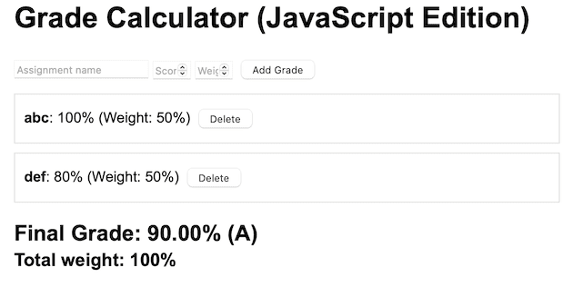

<!-- _class: lead -->
<!-- _class: frontpage -->
<!-- _paginate: skip -->

# Grade Calculator Example in JavaScript

JavaScript + HTML Code

---

## HTML


- Three inputs and one button

```html
  <h1>Grade Calculator (JavaScript Edition)</h1>

  <div id="grade-form">
    <input type="text" id="assignment-name" placeholder="Assignment name">
    <input type="number" id="score" placeholder="Score" min="0" max="100">
    <input type="number" id="weight" placeholder="Weight %" min="0" max="100">
    <button onclick="addGrade()">Add Grade</button>
  </div>

  <div id="grades-list"></div>
  <div id="result" class="result"></div>

  <script src="app.js"></script>
```

---

With two grades, 100 (50%) and 80 (50%), the final value is calculated and displayed: 100*0.5 + 80*0.5 = 90 (A)



---

## Data Structure

```javascript
// Grade Calculator Application
let grades = [];
```

---

## Business Logic

```javascript
// Add a new grade
function addGrade() {
  // Get input values
  const nameInput = document.getElementById('assignment-name');
  const scoreInput = document.getElementById('score');
  const weightInput = document.getElementById('weight');

  const name = nameInput.value.trim();
  const score = parseFloat(scoreInput.value);
  const weight = parseFloat(weightInput.value);

  // Validation
  if (!name || isNaN(score) || isNaN(weight)) {
    alert('Please fill in all fields correctly');
    return;
  }
```

---

```javascript
  // Create grade object
  const grade = {
    id: Date.now(),
    name: name,
    score: score,
    weight: weight
  };

  // Add to array
  grades.push(grade);

  // Clear inputs
  nameInput.value = '';
  scoreInput.value = '';
  weightInput.value = '';

  // Update display
  displayGrades();
  calculateFinalGrade();
}
```

---

```javascript
// Delete a grade
function deleteGrade(id) {
  grades = grades.filter(grade => grade.id !== id);
  displayGrades();
  calculateFinalGrade();
}
```

---

```js
// Convert percentage to letter grade
function getLetterGrade(percentage) {
  if (percentage >= 90) return 'A';
  if (percentage >= 80) return 'B';
  if (percentage >= 70) return 'C';
  if (percentage >= 60) return 'D';
  return 'F';
}
```

---

### UI Logic + Business Logic

Displaying information logic is intermingled with Business Logic.

1. Access the information from HTML using ID.
2. Store the information back to the HTML.

```javascript
// Display all grades
function displayGrades() {
  const gradesList = document.getElementById('grades-list');

  gradesList.innerHTML = grades.map(grade => `<div class="grade-item">
            <strong>${grade.name}</strong>:
            ${grade.score}% (Weight: ${grade.weight}%)
            <button onclick="deleteGrade(${grade.id})">Delete</button>
        </div>
    `).join('');
}
```

---

Calculate final grade: Business logic + UI logic combined

```js
function calculateFinalGrade() {
  const resultDiv = document.getElementById('result');

  if (grades.length === 0) {
    resultDiv.innerHTML = 'No grades yet';
    return;
  }

  // Calculate weighted average
  const totalWeight = grades.reduce((sum, grade) => sum + grade.weight, 0);

  if (totalWeight === 0) {
    resultDiv.innerHTML = 'Total weight must be greater than 0';
    return;
  }

  const weightedSum = grades.reduce((sum, grade) => {
    return sum + (grade.score * grade.weight);
  }, 0);

  const finalGrade = weightedSum / totalWeight;
  const letterGrade = getLetterGrade(finalGrade);

  resultDiv.innerHTML = `
Final Grade: ${finalGrade.toFixed(2)}% (${letterGrade})
        <br>
        <small>Total weight: ${totalWeight}%</small>
    `;
}
```

---

### Event Handler

Add grade when Enter is pressed:

```js
// Keyboard support
document.addEventListener('DOMContentLoaded', () => {
  const inputs = document.querySelectorAll('input');
  inputs.forEach(input => {
    input.addEventListener('keypress', (e) => {
      if (e.key === 'Enter') {
        addGrade();
      }
    });
  });
});
```
