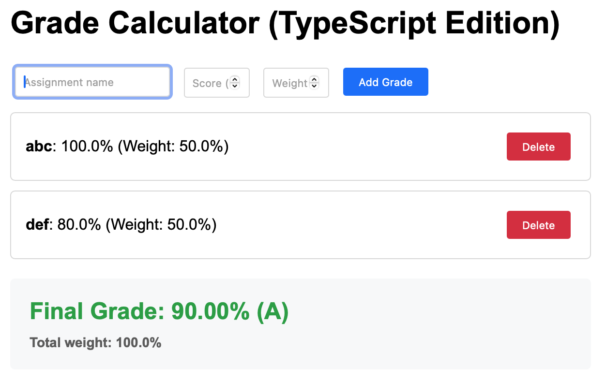

<!-- _class: lead -->
<!-- _class: frontpage -->
<!-- _paginate: skip -->

# Grade Calculator Example in TypeScript

TypeScript + HTML

---

## Install TypeScript

Use npm to install typescript.

```bash
npm install -g typescript
```

---

## Compile TypeScript to JavaScript

We need to compile TypeScript code using
the tsc compiler.

```bash
tsc src/app.ts --outDir . --target ES2018
```

---

## tsconfig.json

We can use tsconfig.json that has all the configuration information.

```json
{
  "compilerOptions": {
    "target": "ES2018",
    "module": "es2015",
    "lib": ["ES2018", "DOM"],                              
    "outDir": "../dist",
    "rootDir": "./",
    "strict": true,
  },
  "include": [
    "**/*"
  ],
  "exclude": [
    "node_modules"
  ]
}
```

---

- We can create the tsconfig.json using `tsc --init`.
- We can adjust the tsconfig.json.
- We run `tsc` to compile the typescript code.

We can use watch mode `tsc --watch` to automatcially recompile on save.

---

## HTML



---

Basically the same as JavaScript.

- The generated JavaScript is accessed in "../app.js".

```html
  <h1>Grade Calculator (TypeScript Edition)</h1>

  <div id="grade-form">
    <input type="text" id="assignment-name" placeholder="Assignment name" required>
    <input type="number" id="score" placeholder="Score (0-100)" min="0" max="100" step="0.1" required>
    <input type="number" id="weight" placeholder="Weight %" min="0" max="100" step="0.1" required>
    <button id="add-grade-btn" type="button">Add Grade</button>
  </div>

  <div id="error-message" class="error"></div>
  <div id="grades-list"></div>
  <div id="result" class="result"></div>

  <script src="../app.js"></script>
```

---

## TypeScript Interfaces & Classes

### Grade Interface

```tsx
interface Grade {
  id: number;
  name: string;
  score: number;
  weight: number;
}
```

---

### Grade Calculator Class

This class has all the data structure, business logic, and UI using the OOP technology.

#### 1. Data Structure

```tsx
class GradeCalculator {
  private grades: Grade[] = [];
```

---

#### 2. Constructor

It is well organized, but it still needs to access and update UI component.

```tsx
  constructor() {
    // Set up event listeners
    const addButton = document.getElementById('add-grade-btn') as HTMLButtonElement;
    addButton.addEventListener('click', () => this.addGrade());

    // Enter key support
    const inputs = document.querySelectorAll('input');
    inputs.forEach(input => {
      input.addEventListener('keypress', (e) => {
        if ((e as KeyboardEvent).key === 'Enter') {
          this.addGrade();
        }
      });
    });

    // Initial display
    this.displayGrades();
  }
```

---

#### 3. addGrade Methods: get information

Get all the information from HTML

```tsx
  private addGrade(): void {
    // Get input elements
    const nameInput = document.getElementById('assignment-name') as HTMLInputElement;
    const scoreInput = document.getElementById('score') as HTMLInputElement;
    const weightInput = document.getElementById('weight') as HTMLInputElement;
    const errorDiv = document.getElementById('error-message') as HTMLDivElement;

    // Get values
    const name = nameInput.value.trim();
    const score = parseFloat(scoreInput.value);
    const weight = parseFloat(weightInput.value);

    // Clear previous error
    errorDiv.textContent = '';

    // Simple validation
    if (!name) {
      errorDiv.textContent = 'Please enter an assignment name';
      return;
    }
```

---

#### 3. addGrade Methods: add to an array

Create the Grade object and store it into the grades array.

```tsx
    // Create grade
    const grade: Grade = {
      id: Date.now(),
      name: name,
      score: score,
      weight: weight
    };

    // Add to array
    this.grades.push(grade);

    // Clear inputs
    nameInput.value = '';
    scoreInput.value = '';
    weightInput.value = '';
    nameInput.focus();

    // Update display
    this.displayGrades();
    this.calculateFinalGrade();
  }
```

---

#### 3. addGrade Methods: display results

```tsx
  private displayGrades(): void {
    const gradesList = document.getElementById('grades-list') as HTMLDivElement;

    if (this.grades.length === 0) {
      gradesList.innerHTML = '<p style="text-align: center; color: #666;">No grades yet. Add one above!</p>';
      return;
    }

    gradesList.innerHTML = this.grades.map(grade => `
      <div class="grade-item">
        <div class="grade-info">
          <strong>${grade.name}</strong>: 
          ${grade.score.toFixed(1)}% (Weight: ${grade.weight.toFixed(1)}%)
        </div>
        <button class="delete" onclick="window.deleteGrade(${grade.id})">Delete</button>
      </div>
    `).join('');
  }
```

---

```tsx
  private deleteGrade(id: number): void {
    this.grades = this.grades.filter(grade => grade.id !== id);
    this.displayGrades();
    this.calculateFinalGrade();
  }
```

---

```tsx
  private calculateFinalGrade(): void {
    const resultDiv = document.getElementById('result') as HTMLDivElement;

    if (this.grades.length === 0) {
      resultDiv.innerHTML = 'Add grades to see your final grade';
      return;
    }

    // Calculate weighted average
    const totalWeight = this.grades.reduce((sum, grade) => sum + grade.weight, 0);

    if (totalWeight === 0) {
      resultDiv.innerHTML = 'Total weight must be greater than 0';
      return;
    }

    const weightedSum = this.grades.reduce((sum, grade) => {
      return sum + (grade.score * grade.weight);
    }, 0);

    const finalGrade = weightedSum / totalWeight;
    const letterGrade = this.getLetterGrade(finalGrade);

    resultDiv.innerHTML = `
      <div style="color: ${this.getGradeColor(letterGrade)}">
        Final Grade: ${finalGrade.toFixed(2)}% (${letterGrade})
      </div>
      <div style="font-size: 14px; color: #666; margin-top: 10px;">
        Total weight: ${totalWeight.toFixed(1)}%
        ${totalWeight < 100 ? 
          `<br><em>Note: Only ${totalWeight.toFixed(1)}% of grades entered</em>` : 
          ''}
      </div>
    `;
  }
```

---

```tsx
  private getLetterGrade(percentage: number): string {
    if (percentage >= 90) return 'A';
    if (percentage >= 80) return 'B';
    if (percentage >= 70) return 'C';
    if (percentage >= 60) return 'D';
    return 'F';
  }

  private getGradeColor(grade: string): string {
    const colors: { [key: string]: string } = {
      'A': '#28a745',
      'B': '#20c997',
      'C': '#ffc107',
      'D': '#fd7e14',
      'F': '#dc3545'
    };
    return colors[grade] || '#000';
  }

  // Make deleteGrade available globally for onclick
  public setupGlobalDelete(): void {
    (window as any).deleteGrade = (id: number) => this.deleteGrade(id);
  }
}
```

---

Event handler:

```tsx
// Initialize when page loads
document.addEventListener('DOMContentLoaded', () => {
  const calculator = new GradeCalculator();
  calculator.setupGlobalDelete();
});
