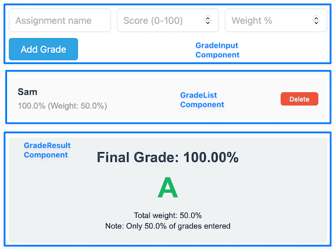

<!-- _class: lead -->
<!-- _class: frontpage -->
<!-- _paginate: skip -->

# Grade Calculator Example in TypeScript + React

How to Read TypeScript + React Code

---

## Compilation of TypeScript files

We need to compile the TypeScript + React source (tsx)

### Install Node.js

This is part of HW1: it installs the following tools:

1. npm
2. npx

---

### Install React library using Node

Make a `package.json` file and add the dependencies:

```json
  "dependencies": {
    "react": "^18.3.1",
    "react-dom": "^18.3.1"
  },
```  

Then, run `npm install` to install the packages.

---

### Build using `esbuild`

We need to generate a single JavaScript file from typescript source file.

```bash
esbuild src/App.tsx \
    --bundle \
    --outfile=app.js \
    --format=iife \
    --global-name=AppModule
```

---

esbuild automatically:

- Transpiles TypeScript → JavaScript in memory using its fast built-in TypeScript compiler (not tsc)
- Finds all your imports (`import React from 'react'`)
- Downloads and includes React from node_modules
- Bundles everything into app.js
- Creates the global `AppModule` variable

---

We use the "scripts"/"build" section in `package.json` to run the build command `npm run build`.

- Notice that we choose to use global-name "AppModule".

```config
  "scripts": {
    "build": "esbuild src/App.tsx 
      --bundle 
      --outfile=app.js 
      --format=iife 
      --global-name=AppModule",
  }
```

---

### Run the React Web Application

1. We can open the HTML file in the web browser through the file:// protocol.

2. Run the local web server and access the HTML file throught the http:// protocol.

---

## app.js and AppModule

The generate app.js is a huge JavaScript code that has all the React code in it.

- It has a function AppModule that has all the code to run the React application.

```javascript
var AppModule = (() => {
  var __create = Object.create;
  var __defProp = Object.defineProperty;
  var __getOwnPropDesc = Object.getOwnPropertyDescriptor;
  var __getOwnPropNames = Object.getOwnPropertyNames;
  var __getProtoOf = Object.getPrototypeOf;
  var __hasOwnProp = Object.prototype.hasOwnProperty;
  ...
```

---

## Connecting HTML and app.js

### HTML

In the HTML file, there is a placeholder with an id "root".

```html
<body>
  <div id="root"></div>
  ...
</body>  
```

The app.js is imported.

```html
  <script src="../app.js"></script>
```

---

Then, the AppModule's mount function connects the React JSX components to the HTML's root spaceholder.

```html
  <script>
    if (typeof AppModule !== 'undefined' 
      && AppModule.default 
      && AppModule.default.mount) {
      AppModule.default.mount('root');
    } else {
      document.getElementById('root').innerHTML = `...`;
    }
  </script>
```

---

## The App.tsx

The TypeScript + React has the following structure:

```tsx
import React from 'react';
import ReactDOM from 'react-dom/client';

// Components
function ...

// Main Component
function GradeCalculatorApp() {...}

// The mount function
export function mount(elementId: string) {
  ...
  root.render(<GradeCalculatorApp />);
}
export default { mount };
```

---

### Providing the mount function

In the App.tsx code, we should export a mount function to be used in the JavaScript section in the HTML.

```tsx
// Mount function to render the app
export function mount(elementId: string) {
  const container = document.getElementById(elementId);
  if (container) {
    const root = ReactDOM.createRoot(container);
    root.render(<GradeCalculatorApp />);
  }
}

// Export mount function for IIFE global access
export default { mount };
```

---

## React Style: Three Sections

Most TypeScript + React function has three sections:

1. Intefarce to define Props type.
2. Business logic for computation or generating new data
3. Return JSX code

```txt
// 1. Interface
interface I { f: (T1) => T2 }
function f({f}: I) {
  // 2. Business Logic
  ...
  // 3. Return JSX
  return (
    <tag> ... </tag>
  );
}
```

---

From now on, we discuss all the React components of GradeCalculatorApp:

<style>
.columns {
  display: flex;
  gap: 2rem;  
  align-items: center;
}
.column.text {
  flex: 4;
}
.column.image {
  flex: 6;
}
</style>

<div class="columns">
  <div class="column image">



  </div>

  <div class="column text">

- GradeCalulatorApp
   1. GradeInput
   2. GradeList
      1. GradeItem
   3. GradeResult
  
  </div>

</div>

---

## The Main Method: GradeCalculatorApp

### GradeCalculatorApp Business Logic

Initialize state from localStorage

- Get grades state and setGrades function from React.
- If data exists, it's converted from a JSON string back into an array (JSON.parse).
- Otherwise, the state starts as an empty array ([]).

```tsx
  const [grades, setGrades] = React.useState<Grade[]>(() => {
    const saved = localStorage.getItem('grades');
    return saved ? JSON.parse(saved) : [];
  });
```

---

- Save to localStorage whenever grades change.
- The array is converted back to JSON string (JSON.stringify) to be stored.

```tsx
  React.useEffect(() => {
    localStorage.setItem('grades', JSON.stringify(grades));
  }, [grades]);
```

---

Adding a new grade with id added and set grade:

```tsx
const addGrade = (gradeData: Omit<Grade, 'id'>) => {
  const newGrade: Grade = {
    ...gradeData,
    id: Date.now()
  };
  setGrades([...grades, newGrade]);
```

Delete the grade with the id.

```tsx
const deleteGrade = (id: number) => {
  setGrades(grades.filter(g => g.id !== id));
};
```

---

### GradeCalculatorApp JSX

```tsx
// Main App Component
function GradeCalculatorApp() {
  ...
  return (
    <div className="app">
      <h1>Grade Calculator (React Edition)</h1>
      <GradeInput onAdd={addGrade} />
      <GradeList grades={grades} onDelete={deleteGrade} />
      <GradeResult grades={grades} />
    </div>
  );
}
```

---

### HTML Tags

All the HTML tags in HTML are generated from React JSX.

- For example, this JSX javascript code generates HTML `<div>` tag.
- HTML tag requires class="grade-item", but JSX tag requires className="grade-item".

```js
<div className="grade-item">
...
</div>
```

---

- Likewise, the `<h1>Grade Calculator (React Edition)</h1>` React function becomes the `<h1>Grade Calculator (React Edition)</h1>` HTML tag.

---

### The GradeCalculatorApp has three React Components

<style>
.columns {
  display: flex;
  align-items: center;
}
.column.text {
  flex: 7;
}
.column.image {
  flex: 4;
}
</style>

<div class="columns">
  <div class="column image">

```tsx
<GradeInput onAdd={addGrade} />
<GradeList grades={grades} 
  onDelete=deleteGrade} />
<GradeResult grades={grades} />
```

  </div>

  <div class="column text">

- GradeInput to get three inputs and Add Button (addGrade React function is invoked)
- GradeList to display the users input (grades values are displayed with deleteGrade function is invoked)
- GradeResults to display the letter grade (grades values are displayed)

  </div>

</div>  

---


---

## GradeInput Component

### GradeInput Interface

```tsx
// types.ts
export interface Grade {
    id: number;
    name: string;
    score: number;
    weight: number;
}

export type LetterGrade = 'A' | 'B' | 'C' | 'D' | 'F';
```

---

## GradeInput Component

### Interface

- An interface defines the shape (structure) of an object.
- In React, we use it to describe what props a component receives.

```tsx
interface GradeInputProps {
    onAdd: (grade: Omit<Grade, 'id'>) => void;
}
```

means: "This component expects certain props, and they must match this shape."

---

#### 1. What is onAdd function?

```tsx
onAdd: (grade: Omit<Grade, 'id'>) => void;
```

This says:

- It’s a function
- The function takes one parameter named grade
- It returns nothing (void)

So:

- onAdd is a callback function that the parent passes in.

Example usage:

```tsx
<GradeInput onAdd={(grade) => console.log(grade)} />
```

---

#### 2. What is Omit<Grade, 'id'>?

Let’s assume you have a type like:

```tsx
interface Grade {
  id: number; name: string; score: number;
}
```

---

Now, if you’re adding a new grade, it doesn’t have an id yet (because the database or parent component will assign it later).

You can remove a field from a type using Omit:

```tsx
Omit<Grade, 'id'>
```

means: "All properties of Grade, except id."

So this becomes:

```tsx
{ name: string; score: number; }
```

---

#### 3. Putting It All Together

```tsx
interface GradeInputProps {
  onAdd: (grade: Omit<Grade, 'id'>) => void;
}
```

- GradeInputProps defines the props (properties) for a component.
- It expects a single prop: onAdd
- onAdd is a function that takes a grade without an id
- It doesn’t return anything (void).

---

### GradeInput Business Logic

#### 1. make three states using the `useState`

```tsx
function GradeInput({ onAdd }: GradeInputProps) {
    const [name, setName] = useState('');
    const [score, setScore] = useState('');
    const [weight, setWeight] = useState('');
```

<BR/>

The three states correspond to the three inputs.


---

#### 2. make the handleSubmit method

- e is the event object for form submission.
- React.FormEvent is a TypeScript type representing any form event (like onSubmit).
- Without this, TypeScript wouldn’t know what properties (like .preventDefault()) exist.

```tsx
    const handleSubmit = (e: React.FormEvent) => {
```

---

- By default, when you submit a `<form>`, the browser reloads the page.
- That would erase all your React state (this was the problem).

```tsx
e.preventDefault();
```

- Stops the default page reload
- Lets React handle the submission entirely inside JavaScript

---

```tsx
function GradeInput({ onAdd }: GradeInputProps) {
    const [name, setName] = useState('');
    const [score, setScore] = useState('');
    const [weight, setWeight] = useState('');

    // make handler function
    const handleSubmit = (e: React.FormEvent) => {
        e.preventDefault(); // prevent reload
        
        if (name && score && weight) {
            onAdd({ // onAdd is injected by the user
                name,
                score: parseFloat(score),
                weight: parseFloat(weight)
            });
            
            // Clear form <- Automatic UI update
            setName('');
            setScore('');
            setWeight('');
        }
    };
```

---

Usage:

The addGrade function is given to the GradeInput component.

```tsx
const addGrade = (gradeData: Omit<Grade, 'id'>) => {
  // Check total weight
  const currentTotalWeight = grades.reduce((sum, g) => sum + g.weight, 0);
  if (currentTotalWeight + gradeData.weight > 100) {
    alert(`Total weight would exceed 100% (current: ${currentTotalWeight}%)`);
    return;
  }
  const newGrade: Grade = {
    ...gradeData,
    id: Date.now()
  };
  setGrades([...grades, newGrade]);
};
...
<GradeInput onAdd={addGrade} />
```

---

### GradeInput JSX

- It displays the form with an input (value is name).
- When input is given, name is updated (setName) with a given value (e.target.value).

```tsx
<form onSubmit={handleSubmit} lassName="grade-form">
     <input
         type="text"
         value={name}
         onChange={(e) => setName(e.target.value)}
         placeholder="Assignment name"
         required
     />
</form>
```

---

```tsx
return (
    <form onSubmit={handleSubmit} className="grade-form">
        <input
            type="text"
            value={name}
            onChange={(e) => setName(e.target.value)}
            placeholder="Assignment name"
            required
        />
        <input
            type="number"
            value={score}
            onChange={(e) => setScore(e.target.value)}
            placeholder="Score (0-100)"
            min="0" max="100" step="0.1"
            required
        />
        <input
            type="number"
            value={weight}
            onChange={(e) => setWeight(e.target.value)}
            placeholder="Weight %"
            min="0" max="100" step="0.1"
            required
        />
        <button type="submit">Add Grade</button>
    </form>
);
```

---

## GradeList Component

### GradeList interface

```tsx
interface GradeListProps {
    grades: Grade[];
    onDelete: (id: number) => void;
}
```

### GradeList Business Logic

```tsx
function GradeList({ grades, onDelete }: GradeListProps) {
    if (grades.length === 0) {
        return <p className="empty">No grades yet. Add one above!</p>;
    }
```

---

### GradeList JSX

- For each grades items, it generates GradeItem component with key, grade, and onDelete function.

```tsx
return (
    <div className="grade-list">
        {grades.map(grade => (
            <GradeItem 
                key={grade.id}
                grade={grade} 
                onDelete={onDelete}                    
            />
        ))}
    </div>
);
```

```tsx
const deleteGrade = (id: number) => {
  setGrades(grades.filter(g => g.id !== id));
};
```

---

## GradeItem Component

### GradeItem Interface

```tsx
interface GradeItemProps {
    grade: Grade;
    onDelete: (id: number) => void;
}
```

---

### GradeItem JSX

- Each item displays name, score, and weight
- It also shows a button to use onDelete function.

```tsx
function GradeItem({ grade, onDelete }: GradeItemProps) {
    return (
        <div className="grade-item">
            <div className="grade-info">
                <strong>{grade.name}</strong>
                <span>{grade.score}% (Weight: {grade.weight}%)</span>
            </div>
            <button 
                className="delete-btn"
                onClick={() => onDelete(grade.id)}
            >
                Delete
            </button>
        </div>
    );
}
```

---

## GradeResult Component

### GradeResult Interface

```tsx
interface GradeResultProps {
    grades: Grade[];
}
```

---

### GradeResult Business Logic

- Get the total weight; return error when the weight sum is 0.
- Get the score * weight sum.

```tsx
const calculateResult = () => {
    if (grades.length === 0) return null;
    
    const totalWeight = grades.reduce((sum, g) => sum + g.weight, 0);
    if (totalWeight === 0) return null;
    
    const weightedSum = grades.reduce(
        (sum, g) => sum + (g.score * g.weight), 
        0
    );
    
    const finalGrade = weightedSum / totalWeight;
    const letterGrade = getLetterGrade(finalGrade);
    
    return { finalGrade, letterGrade, totalWeight };
};
```

---

- The result is null, display the information.

```tsx
const result = calculateResult();

if (!result) {
    return <div className="result">Add grades to see result</div>;
}
```

---

### GradeResult JSX

```tsx
return (
    <div className="result">
        <h2>Final Grade: {result.finalGrade.toFixed(2)}%</h2>
        <div className={`letter-grade grade-${result.letterGrade}`}>
            {result.letterGrade}
        </div>
        <small>Total weight: {result.totalWeight}%</small>
    </div>
);
```

---

- This is a function to get the letter grade.

```tsx
function getLetterGrade(score: number): LetterGrade {
    if (score >= 90) return 'A';
    if (score >= 80) return 'B';
    if (score >= 70) return 'C';
    if (score >= 60) return 'D';
    return 'F';
}
```
